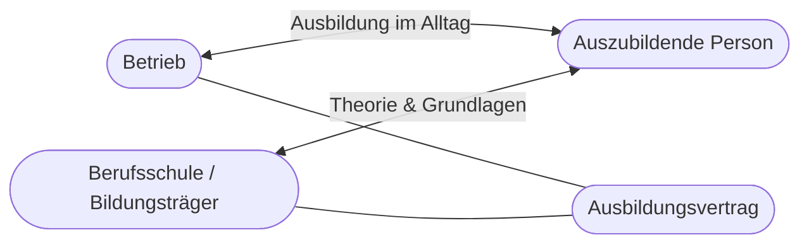
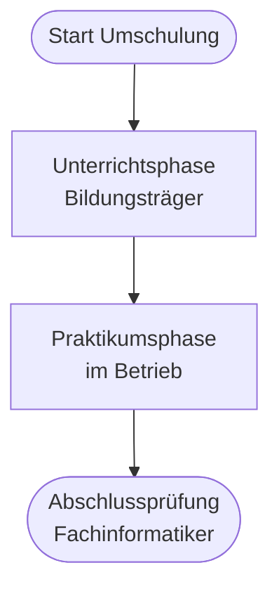

# Kapitel 1 – Berufsbildung und Umschulung

  

  

  

  

  

  

  

  

  

  

<h3>Was du in diesem Kapitel lernst</h3>

- Was das duale System der Berufsausbildung ist und welche Rollen die Beteiligten haben
- Wie die Umschulung zum Fachinformatiker strukturiert ist und welche **vier Fachrichtungen** es gibt
- Welche Unterschiede zwischen regulärer Berufsausbildung (3 Jahre) und Umschulung (2 Jahre) bestehen
- Was einen geeigneten Praktikumsbetrieb ausmacht und welche Anforderungen er erfüllen muss

---

## So gehst du vor

1. Lies die Kapitelinhalte und präge dir die Struktur des dualen Systems ein.
2. Bearbeite die **Kurzübungen** der Reihe nach – von Grundlagen bis Experte.
3. Arbeite die **Workshop-Aufgabe** durch. Sie vertieft das Gelernte an einem zusammenhängenden Szenario.

---

## 1.1 Das duale System der Berufsausbildung

In Deutschland ist die **berufliche Ausbildung** in der Regel **dual** organisiert: Sie findet an **zwei Lernorten** statt – im **Betrieb** und in der **Berufsschule** (oder vergleichbarer Einrichtung). Beide Orte ergänzen sich und sind rechtlich miteinander verknüpft.

**Zentrale Beteiligte im dualen System:**

| Beteiligter | Rolle |
|---|---|
| Auszubildende Person | Lernt berufliche Handlungsfähigkeit, erfüllt Pflichten aus dem Ausbildungsvertrag |
| Ausbildungsbetrieb | Verantwortet die betriebliche Ausbildung, stellt Ausbilder und Arbeitsplatz |
| Berufsschule / Bildungsträger | Unterrichtet berufsbezogene und allgemeine Inhalte |
| Kammer (z. B. IHK) | Prüft Ausbildungsbetriebe, berät, führt Prüfungen durch |
| Bundesministerium / Landesregierung | Schreibt Ausbildungsordnungen und Rahmenlehrpläne |

!!! info "Vier Fachrichtungen beim Fachinformatiker"
    Seit der **Fachinformatikerausbildungsverordnung (FIAusbV, 2020)** gliedert sich der Beruf in **vier Fachrichtungen**. Allen gemeinsam ist ein fachrichtungsübergreifender Teil; ab der Spezialisierung unterscheiden sich Schwerpunktinhalte und **Teil 2 der Abschlussprüfung**:

    | Fachrichtung | Kurz | Schwerpunkt (Auswahl) |
    |---|---|---|
    | Anwendungsentwicklung | AE | Software konzipieren, entwickeln, Qualität sichern |
    | Systemintegration | SI | IT-Systeme, Netzwerke, Administration |
    | Daten- und Prozessanalyse | DPA | Prozesse und Daten analysieren, optimieren, Datenschutz |
    | Digitale Vernetzung | DV | Vernetzte Systeme planen, errichten, betreiben (IoT/Industrie 4.0) |

    In der **Umschulung** werden häufig noch **AE** und **SI** angeboten – prüfe beim Bildungsträger und bei Betrieben, welche Fachrichtungen verfügbar sind.

---

## 1.2 Deine Rolle in der Umschulung

Als **Umschüler** zum Fachinformatiker durchläufst du ein beschleunigtes Qualifizierungsprogramm. Du bist keine „klassische" Auszubildende Person im ersten Lehrjahr – dein Werdegang, deine Vorerfahrung und der zeitliche Ablauf unterscheiden sich von einer regulären Ausbildung.

**Typischer Ablauf der Umschulung IT:**

1. **Unterrichtsphase** beim Bildungsträger (oft online): Grundlagen, WISO, Fachinhalte, Prüfungsvorbereitung
2. **Praktikumsphase** im Betrieb: Anwendung des Gelernten, betriebliche Ausbildung, Vorbereitung auf die Abschlussprüfung
3. **Abschlussprüfung** vor der zuständigen Stelle (in der Regel IHK)

**Deine Rolle bedeutet:**

- Du bist **Lernende Person** mit eigenverantwortlichem Lernen – besonders in der Online-Unterrichtsphase
- Du absolvierst später ein **Betriebspraktikum**. Anders als ein regulärer Azubi hast du dort **keinen Ausbildungsvertrag** und **keine Ausbildungsvergütung** – deine Finanzierung läuft weiter über die Agentur für Arbeit bzw. den Bildungsträger
- Du trägst Verantwortung für deinen **Lernfortschritt**, die **Vorbereitung auf den Praktikumsbetrieb** und die **Abschlussprüfung**

!!! warning "Umschüler-Praktikum ≠ Ausbildungsverhältnis"
    Wichtige Unterscheidung für dieses Modul:

    - **Als Umschüler** bei einem Bildungsträger machst du ein **unbezahltes Betriebspraktikum**: kein Ausbildungsvertrag mit dem Betrieb, keine Ausbildungsvergütung, keine Sozialversicherung aus einer Beschäftigung.
    - **Ein regulärer Azubi** hat einen **Ausbildungsvertrag**, bekommt **Ausbildungsvergütung** und ist sozialversicherungspflichtig.

    Die WISO-Inhalte zu **Ausbildungsvertrag, Entgeltabrechnung und Sozialversicherung** lernst du am Beispiel des **regulären Ausbildungsverhältnisses** – das ist Prüfungsstoff und gilt für dein späteres Beschäftigungsverhältnis. Wo es ausdrücklich um deine eigene Umschüler-Situation geht, ist das gesondert gekennzeichnet.

---

## 1.3 Reguläre Ausbildung vs. Umschulung

| Merkmal | Reguläre Berufsausbildung | Umschulung Fachinformatiker |
|---|---|---|
| Dauer | In der Regel **3 Jahre** | In der Regel **2 Jahre** |
| Zielgruppe | Meist Jugendliche nach Schule | Erwachsene mit Berufserfahrung oder abgeschlossener Erstausbildung |
| Einstieg | Direkt nach Schule oder früh im Lebenslauf | Nach Qualifizierungsvoraussetzungen (z. B. Arbeitsagentur, Bildungsgutschein) |
| Lernorte | Betrieb und Berufsschule parallel | Zunächst Bildungsträger, später Praktikumsbetrieb |
| Finanzierung | Ausbildungsvergütung vom Betrieb | Durchgehend über Agentur (ALG/Bürgergeld/Übergangsgeld) + Bildungsgutschein; Betriebspraktikum unbezahlt |
| Tempo | Gleichmäßiger Jahresrhythmus über 3 Jahre | Verdichteter Stoff, höheres Lerntempo |

**Gemeinsamkeiten:**

- Gleiche **Abschlussprüfung** nach der Ausbildungsordnung Fachinformatiker (vor der IHK)
- **Dualer Charakter**: Verbindung von Theorie und betrieblicher Praxis
- Orientierung an denselben **Ausbildungsinhalten** (Ausbildungsordnung / Rahmenlehrplan)

!!! note "Kein Ausbildungsvertrag im Umschüler-Praktikum"
    Der **Ausbildungsvertrag** und die **BBiG-Rechte eines Azubis** gehören zum regulären Ausbildungsverhältnis – **nicht** zum unbezahlten Umschüler-Praktikum. Mit dem Praktikumsbetrieb besteht nur ein **Praktikumsvertrag**.

!!! warning "Nicht „weniger Ausbildung""
    Die Umschulung ist **zeitlich verkürzt**, nicht inhaltlich „abgespeckt". Du musst vergleichbare Kompetenzen in weniger Zeit aufbauen – das erfordert strukturiertes und selbstgesteuertes Lernen.

---

## 1.4 Der Praktikumsbetrieb

Der **Praktikumsbetrieb** ist der Ort deiner **betrieblichen Praxisphase** während der Umschulung. Du schließt mit ihm in der Regel einen **Praktikumsvertrag** (kein Ausbildungsvertrag) – das Praktikum ist **unbezahlt**. Trotzdem sollte der Betrieb fachlich und organisatorisch geeignet sein, damit du echte Praxis für Prüfung und Beruf sammelst.

**Anforderungen an einen geeigneten Praktikumsbetrieb (Auswahl):**

| Anforderung | Erklärung |
|---|---|
| Fachliche Eignung | Betrieb arbeitet real im Bereich deiner Fachrichtung (AE, SI, DPA, DV) |
| Passende Tätigkeiten | Aufgaben mit Bezug zu den Ausbildungsinhalten, nicht nur „Zuschauen" |
| Betreuung | Feste Ansprechperson/Mentor, die dich anleitet |
| Ausstattung | Arbeitsplatz, Zugänge, Technik für sinnvolles Arbeiten |
| Praktikumsdauer | Ausreichend lang für einen echten Kompetenzaufbau |
| Absprache mit Bildungsträger | Praktikumsvertrag, Ziele und Nachweise abgestimmt |

!!! info "Abgrenzung zum Ausbildungsbetrieb"
    Ein **regulärer Ausbildungsbetrieb** (für Azubis) muss zusätzlich strengere BBiG-Anforderungen erfüllen: **Ausbildungsvertrag**, **Ausbildungsbefähigung** der Kammer, **betrieblicher Ausbildungsplan** und **Ausbildungsvergütung**. Diese lernst du in Kapitel 2 und 3 kennen – sie gelten für das **Ausbildungsverhältnis**, nicht für dein unbezahltes Umschüler-Praktikum.

**Worauf du bei der Betriebswahl achten solltest:**

- **Fachrichtung passend?** Passt der Betrieb zu deiner Zielrichtung (AE, SI, DPA oder DV)?
- **Ausbildungsstruktur:** Gibt es feste Ausbildungsinhalte, Mentoring, Zeit für Lernen?
- **Technologie-Stack:** Welche Sprachen, Frameworks, Infrastruktur werden genutzt?
- **Ausbilder:** Wer ist ausbildungsbefähigt und wie viel Zeit steht für Anleitung zur Verfügung?
- **Übernahmechancen:** Gibt es Perspektive nach der Prüfung?

!!! info "Suche früh starten"
    Auch wenn der Praktikumsbetrieb später beginnt: **Bewerbungen, Netzwerken und Kammerberatung** solltest du frühzeitig starten. Ein passender Betrieb ist entscheidend für Prüfungserfolg und Karrierestart.

---

## Kurzübungen

{{ task(file="tasks/tag1_01.yaml") }}

{{ task(file="tasks/tag1_02.yaml") }}

{{ task(file="tasks/tag1_03.yaml") }}

---

## Workshop

{{ task(file="tasks/workshop_k1.yaml") }}
