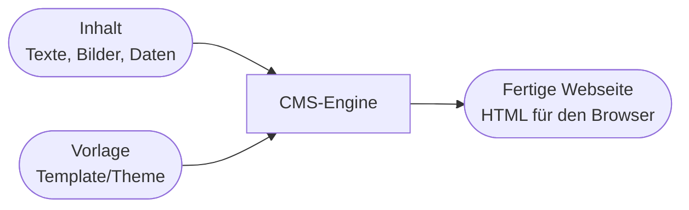
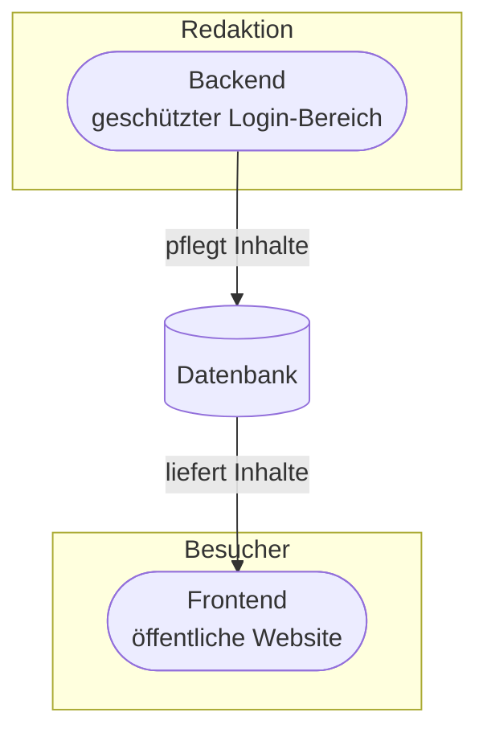
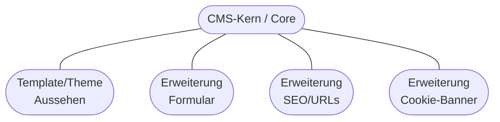
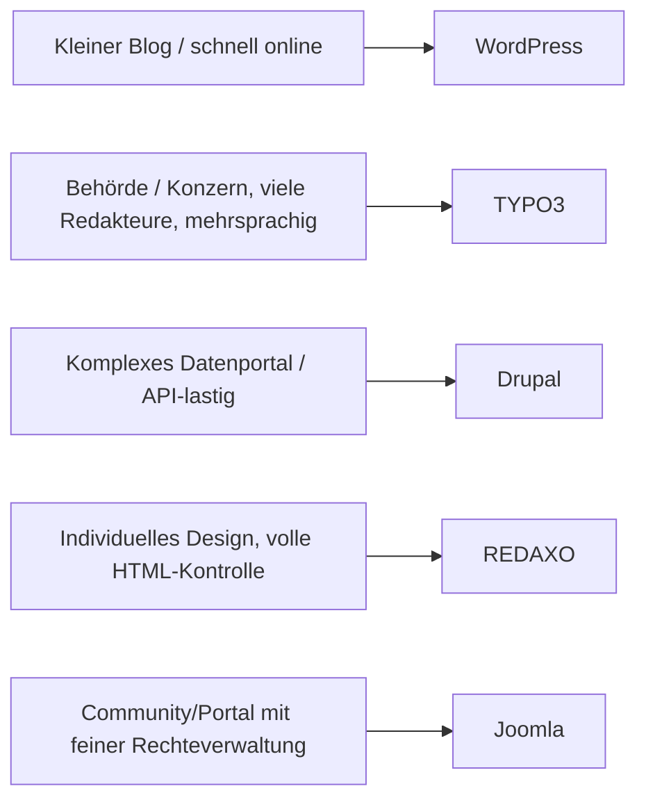

# Kapitel 1 – Was ist ein CMS?

  

  

  

  

  

  

  

  

  

  

<h3>Was du in diesem Kapitel lernst</h3>

- Was ein **Content-Management-System (CMS)** ist und welches **Grundprinzip** dahintersteht
- Warum ein CMS **Inhalt, Struktur und Darstellung trennt** und was **Frontend** und **Backend** unterscheidet
- Was **Templates/Themes** und **Erweiterungen (Plugins/AddOns)** sind und wie sie zusammenwirken
- Wie du die CMS-Varianten **WordPress, Joomla, TYPO3, Drupal** (und **REDAXO**) nach Einsatzzweck einordnest
- Warum wir in diesem Kurs mit **REDAXO 5** arbeiten

---

## So gehst du vor

1. Lies die Kapitelinhalte und präge dir die **Trennung von Inhalt und Darstellung** ein – sie ist das Herzstück jedes CMS.
2. Bearbeite die **Kurzübungen** der Reihe nach (Vormittag, gemeinsam im Unterricht).
3. Arbeite am Nachmittag die **Workshop-Aufgabe** eigenständig durch.

---

## 1.1 Das Problem: Websites ohne CMS

Eine Website besteht technisch aus **HTML** (Struktur/Inhalt), **CSS** (Aussehen) und oft **JavaScript** (Verhalten). Ohne CMS pflegt man diese Dateien **per Hand** und lädt sie per FTP auf einen Webserver.

Das funktioniert für eine einzelne Seite. Sobald eine Website aber **viele Seiten**, **mehrere Redakteure** und **regelmäßige Aktualisierungen** hat, entstehen Probleme:

| Problem ohne CMS | Auswirkung |
|---|---|
| Jede Seite ist eine eigene HTML-Datei | Menü-Änderung muss in **allen** Dateien nachgezogen werden |
| Inhalt und Design stecken in derselben Datei | Redakteure brauchen HTML-Kenntnisse, um Texte zu ändern |
| Keine Benutzerverwaltung | Jeder mit FTP-Zugang kann alles überschreiben |
| Keine Versionierung | Ein Fehler überschreibt den alten Stand unwiederbringlich |
| Kein Workflow | Kein „Entwurf → Prüfen → Veröffentlichen" |

!!! info "Statisch vs. dynamisch"
    Eine **statische** Website liefert für jede Adresse eine fertige HTML-Datei aus. Ein CMS erzeugt Seiten **dynamisch**: Bei jedem Aufruf setzt es die Seite aus **Bausteinen** (Inhalt aus der Datenbank + Vorlage) zusammen. Dadurch pflegst du eine Vorlage **einmal** und alle Seiten übernehmen die Änderung.

---

## 1.2 Grundprinzip: Trennung von Inhalt, Struktur und Darstellung

Ein **Content-Management-System** ist eine Software, mit der man **Inhalte erstellen, verwalten und veröffentlichen** kann – ohne jede Seite von Hand zu programmieren. Das zentrale Prinzip ist die **Trennung von Inhalt und Darstellung**:

- **Inhalt** liegt in einer **Datenbank** (z. B. der Text eines Artikels, ein Titel, ein Datum).
- **Darstellung** steckt in **Templates/Themes** (wie eine Seite aussieht: Kopfzeile, Menü, Spalten, Farben).
- Bei jedem Seitenaufruf **kombiniert** das CMS beides zu fertigem HTML.

!!! tip "Warum diese Trennung so wichtig ist"
    Weil sie Rollen entkoppelt: **Redakteure** pflegen Inhalte, ohne Design zu zerstören. **Designer/Entwickler** ändern das Layout **einmal** im Template – und alle Seiten übernehmen es. Das spart Zeit, reduziert Fehler und macht Teamarbeit erst möglich.

**Typische Bausteine, die (fast) jedes CMS kennt:**

| Baustein | Bedeutung |
|---|---|
| Inhalt / Content | Die eigentlichen Daten: Seiten, Beiträge, Bilder, Dateien |
| Struktur | Hierarchie der Seiten (Menü, Kategorien, Navigationsbaum) |
| Template / Theme | Vorlage für das Aussehen (HTML-Gerüst + CSS) |
| Erweiterung | Zusatzfunktion (Formular, Shop, Newsletter, SEO …) |
| Benutzer & Rechte | Wer darf was sehen und bearbeiten |
| Medienverwaltung | Zentrale Ablage für Bilder, PDFs, Videos |

---

## 1.3 Frontend und Backend

Jedes CMS hat **zwei Seiten**:

| | Frontend | Backend |
|---|---|---|
| Wer nutzt es? | Alle **Besucher** der Website | **Redakteure & Administratoren** |
| Was ist es? | Die **öffentliche Website** | Die **Verwaltungsoberfläche** (Login nötig) |
| Zweck | Inhalte **ansehen** | Inhalte **erstellen, ändern, veröffentlichen** |
| Beispiel REDAXO | `https://deine-domain.de/` | `https://deine-domain.de/redaxo/` |

!!! info "Backend-Adresse merken"
    Bei **REDAXO** erreichst du das Backend über den Pfad **`/redaxo/`** hinter der Domain. Bei WordPress ist es `/wp-admin/`, bei TYPO3 `/typo3/`. Diese Adresse ist der Login-Bereich – ihn abzusichern ist später ein eigenes Thema (Kapitel 10).

---

## 1.4 Templates/Themes und Erweiterungen

**Template / Theme** – die Vorlage für das Aussehen. Sie legt fest, wo Logo, Menü, Inhalt und Fußzeile stehen. Ein Theme wird meist mit **HTML + CSS** (und etwas Template-Logik) beschrieben. Wechselt man das Theme, ändert sich das Aussehen der ganzen Website – die Inhalte bleiben gleich.

**Erweiterung** – Zusatzfunktionen, die der Kern („Core") nicht mitbringt. Je nach CMS heißen sie **Plugin, Extension, Modul oder AddOn**. Beispiele: Kontaktformular, Newsletter, Online-Shop, SEO-Werkzeuge, Cookie-Banner, Backup.

!!! warning "Core-Hacks vermeiden"
    Ein **Core-Hack** ist eine direkte Änderung an den Kern-Dateien des CMS. Das ist gefährlich: Beim nächsten **Update** werden diese Dateien überschrieben – deine Änderung ist weg oder verursacht Fehler. Deshalb gilt die Regel: **Anpassungen gehören ins Template oder in Erweiterungen, niemals in den Core.** Dieses Prinzip zieht sich durch den ganzen Kurs (besonders Kapitel 7 & 8).

**Namensgebung je CMS (Erweiterungen):**

| CMS | Begriff für Erweiterung | Begriff für Aussehen |
|---|---|---|
| WordPress | Plugin | Theme |
| Joomla | Extension (Component/Module/Plugin) | Template |
| TYPO3 | Extension | Template (TypoScript/Fluid) |
| Drupal | Module | Theme |
| REDAXO | AddOn | Template + Module |

---

## 1.5 CMS-Varianten nach Einsatzzweck einordnen

Es gibt hunderte CMS. Für die Prüfung und die Praxis solltest du die **großen vier** einordnen können – plus **REDAXO**, mit dem wir arbeiten. Alle sind **Open Source** und basieren auf **PHP + MySQL/MariaDB**.

| CMS | Typischer Einsatzzweck | Stärken | Zu bedenken |
|---|---|---|---|
| **WordPress** | Blogs, kleine bis mittlere Websites, Marketing-Seiten | Riesiges Ökosystem, schnell startklar, viele Themes/Plugins | Sicherheit stark plugin-abhängig; für sehr individuelle Strukturen weniger flexibel |
| **Joomla** | Mittlere Websites, Communitys, Portale | Feine Benutzer-/Rechteverwaltung, mehrsprachig „ab Werk" | Steilere Lernkurve als WordPress |
| **TYPO3** | Große Unternehmens- & Behörden-Websites (Enterprise) | Sehr mächtig, mehrsprachig, große Redaktionsteams, granulare Rechte | Komplex, hoher Einarbeitungs- und Pflegeaufwand |
| **Drupal** | Komplexe, datengetriebene Portale, individuelle Strukturen | Extrem flexibles Datenmodell, stark bei Struktur & APIs | Hohe Komplexität, erfordert Entwickler-Know-how |
| **REDAXO** | Individuelle Websites/Kampagnen mit voller HTML-Kontrolle | Schlank, „kein Design vorgegeben", volle Kontrolle über die Ausgabe | Kleineres Ökosystem; man baut Templates/Module selbst |

!!! info "Es gibt kein „bestes" CMS"
    Die richtige Wahl hängt vom **Einsatzzweck** ab: Umfang, Team, Budget, Mehrsprachigkeit, Individualität, vorhandenes Know-how. Ein Blog braucht kein TYPO3; ein Behördenportal ist mit einem Mini-CMS unterfordert.

---

## 1.6 Warum REDAXO in diesem Kurs?

**REDAXO** ist ein deutsches, quelloffenes CMS auf PHP-/MySQL-Basis. Es eignet sich hervorragend zum **Lernen**, weil es die CMS-Grundprinzipien besonders **transparent** macht:

- Es gibt **kein vorgegebenes Design**. Du baust das **Template** selbst aus HTML/CSS – dadurch verstehst du die **Trennung von Inhalt und Darstellung** direkt am eigenen Code.
- Die Kernkonzepte sind klar benannt und überschaubar:

| REDAXO-Begriff | Bedeutung |
|---|---|
| **Struktur / Kategorien & Artikel** | Der Seitenbaum: Kategorien gruppieren, Artikel sind die einzelnen Seiten |
| **Template** | Das HTML-Grundgerüst einer Seite (Kopf, Menü, Fuß) |
| **Modul** | Ein wiederverwendbarer Inhaltsbaustein mit **Eingabe** (Backend-Formular) und **Ausgabe** (Frontend-HTML) |
| **Slice / Block** | Eine konkrete Instanz eines Moduls in einem Artikel (der befüllte Baustein) |
| **Medienpool** | Zentrale Verwaltung für Bilder, PDFs & Co. |
| **AddOn** | Erweiterung (z. B. YForm für Formulare, YRewrite für SEO-URLs) |

!!! tip "Roter Faden des Kurses"
    Wir bauen über fünf Tage schrittweise eine echte REDAXO-Website: **installieren** (K2) → **Datenbank & Konfiguration** (K3) → **Benutzer/Rollen** (K4) → **Struktur & Inhalte** (K5/K6) → **Design** (K7) → **AddOns & Updates** (K8) → **Formulare/Datenschutz** (K9) → **Absichern** (K10).

---

## Kurzübungen

{{ task(file="tasks/kapitel1_01.yaml") }}

{{ task(file="tasks/kapitel1_02.yaml") }}

{{ task(file="tasks/kapitel1_03.yaml") }}

---

## Workshop

{{ task(file="tasks/workshop_k1.yaml") }}
