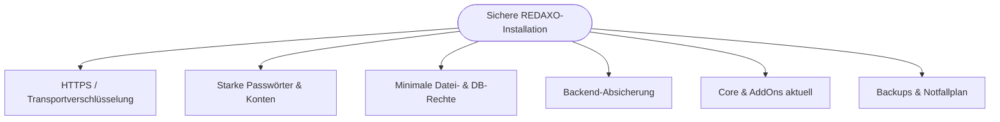
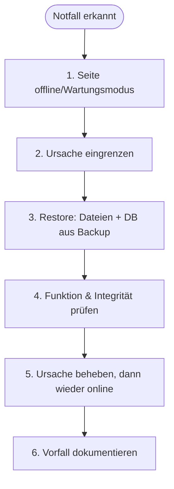
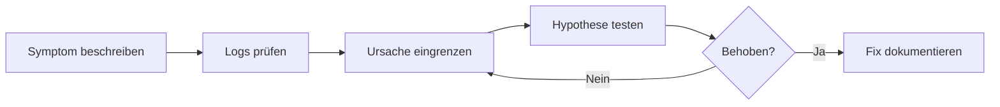

# Kapitel 10 – Sicherheit & Notfallmaßnahmen

<div class="kurs-progress">
  <div class="step done"></div>
  <div class="step done"></div>
  <div class="step done"></div>
  <div class="step done"></div>
  <div class="step done"></div>
  <div class="step done"></div>
  <div class="step done"></div>
  <div class="step done"></div>
  <div class="step done"></div>
  <div class="step active"></div>
</div>

<div class="lernziele" markdown>
<h3>Was du in diesem Kapitel lernst</h3>

- Warum **HTTPS** Pflicht ist und wie es funktioniert
- Wie du **starke Passwörter** und sichere Konten durchsetzt
- Wie du **Datei- und Datenbankrechte** prüfst (Wiederholung & Vertiefung)
- Wie du das **Backend absicherst** (Zugriffsschutz, Live-Modus, Aktualität)
- Wie du **Notfallmaßnahmen** umsetzt: **Backup/Restore** und systematische **Fehleranalyse**
</div>

---

## 10.1 Sicherheit als Querschnittsthema

Sicherheit ist kein einzelner Schalter, sondern zieht sich durch **alle** vorherigen Kapitel. Dieses Kapitel fasst die Schutzmaßnahmen zusammen und ergänzt Notfallmaßnahmen.



!!! info "Defense in Depth"
    Kein einzelner Schutz ist perfekt. Sicherheit entsteht durch **mehrere Schichten** („Defense in Depth"): Fällt eine Maßnahme aus, greifen die anderen. Deshalb kombiniert man **alle** folgenden Punkte, statt sich auf einen zu verlassen.

---

## 10.2 HTTPS

**HTTPS** verschlüsselt die Verbindung zwischen Browser und Server per **TLS**. Ohne HTTPS werden Logins, Formulardaten und Cookies **im Klartext** übertragen und können mitgelesen werden.

| Aspekt | Bedeutung |
|---|---|
| **Zertifikat** | Wird z. B. kostenlos über **Let's Encrypt** ausgestellt |
| **Weiterleitung** | Alle `http://`-Aufrufe per Server-Regel auf `https://` umleiten |
| **HSTS** | Header `Strict-Transport-Security` erzwingt HTTPS im Browser |
| **Mixed Content vermeiden** | Alle Ressourcen (Bilder, CSS) ebenfalls über `https` laden |

```apache
# .htaccess: alles auf HTTPS umleiten
RewriteEngine On
RewriteCond %{HTTPS} off
RewriteRule ^ https://%{HTTP_HOST}%{REQUEST_URI} [R=301,L]
```

!!! warning "Ohne HTTPS keine Formulare/Logins"
    Spätestens sobald deine Seite ein **Login** (Backend!) oder **Formulare** (Kapitel 9) hat, ist HTTPS **zwingend** – auch aus Datenschutzsicht (DSGVO). Setze das **vor** dem Live-Gang um.

---

## 10.3 Starke Passwörter & Konten

| Maßnahme | Umsetzung |
|---|---|
| **Passwortlänge/-komplexität** | Lang (12+ Zeichen), zufällig; Passwort-Manager nutzen |
| **Keine Mehrfachnutzung** | Für jedes System ein eigenes Passwort |
| **2-Faktor-Authentifizierung** | Wo verfügbar aktivieren (zusätzliche Sicherung des Backends) |
| **Individuelle Konten** | Jede Person ein eigenes Konto – keine geteilten Logins (Nachvollziehbarkeit, Kapitel 4) |
| **Admin sparsam** | Admin-Rechte nur für wenige (Kapitel 4) |
| **Offboarding** | Konten ausgeschiedener Personen deaktivieren |

!!! tip "Login-Absicherung in REDAXO"
    REDAXO sperrt nach mehreren Fehlversuchen den Login (Brute-Force-Schutz). Ergänze das durch **starke Passwörter** und – wo möglich – eine **zusätzliche Zugriffsbeschränkung** auf das Backend (Abschnitt 10.5).

---

## 10.4 Datei- und Datenbankrechte prüfen

Wiederholung aus Kapitel 2 & 3, jetzt als **Prüf-Routine**:

**Dateirechte (Linux):**

```bash
# Ordner 755, Dateien 644 als sichere Basis
sudo find /var/www/html -type d -exec chmod 755 {} \;
sudo find /var/www/html -type f -exec chmod 644 {} \;
# Eigentümer = Webserver-Benutzer
sudo chown -R www-data:www-data /var/www/html
```

| Prüfpunkt | Soll-Zustand |
|---|---|
| Keine `777`-Rechte | Nirgends „für alle beschreibbar" |
| `redaxo/data/` nicht öffentlich | Kein direkter Zugriff aus dem Web (enthält `config.yml`!) |
| DB-Benutzer mit Minimalrechten | Nur `redaxo.*`, kein `root` im Betrieb (Kapitel 3) |
| `config.yml` geschützt | Nicht im Web erreichbar, nicht in öffentlichem Git |

!!! warning "Die häufigsten Fehler"
    `777`-Rechte „weil es dann läuft", der **root**-DB-Benutzer im Live-Betrieb und eine öffentlich erreichbare `config.yml` gehören zu den **häufigsten Sicherheitslücken**. Prüfe diese drei Punkte bei jedem Live-Gang.

---

## 10.5 Backend absichern

Das Backend (`/redaxo/`) ist das lohnendste Angriffsziel. Absicherung in mehreren Schichten:

| Maßnahme | Wirkung |
|---|---|
| **HTTPS** | Login verschlüsselt (10.2) |
| **Starke Passwörter / 2FA** | Erschwert Konten-Übernahme (10.3) |
| **IP-Beschränkung / HTTP-Auth** | Zugriff auf `/redaxo/` nur aus bekannten Netzen bzw. mit zusätzlichem Passwort |
| **Live-/Produktivmodus** | Deaktiviert Debug-Ausgaben, versteckt interne Details |
| **`setup: false`** | Setup-Routine nach Installation gesperrt |
| **Aktualität** | Core & AddOns aktuell (Kapitel 8) |

**Beispiel: zusätzliche HTTP-Authentifizierung für das Backend (`.htaccess` im `redaxo/`-Ordner):**

```apache
AuthType Basic
AuthName "Geschuetzter Bereich"
AuthUserFile /pfad/zu/.htpasswd
Require valid-user
```

!!! info "Live-Modus statt Debug"
    Im **Debug-Modus** zeigt REDAXO detaillierte Fehlermeldungen – hilfreich lokal, **gefährlich** live (verrät Pfade, Versionen). Auf dem Live-Server: **Debug aus**, produktiver Betriebsmodus an. Fehlerdetails findest du dann im **Log** (Abschnitt 10.7), nicht im Browser der Besucher.

!!! warning "Erweiterungen aktuell halten"
    Ein einziges veraltetes AddOn mit Sicherheitslücke kann die ganze Seite kompromittieren. **Regelmäßig** Updates prüfen und einspielen (Kapitel 8) ist eine der wirksamsten Schutzmaßnahmen überhaupt.

---

## 10.6 Notfall: Backup & Restore

Trotz aller Vorsorge kann es zum Ernstfall kommen (Angriff, defektes Update, Serverausfall). Dann zählt ein **funktionierendes Backup** und ein **geübter Restore**.



**Restore-Schritte (Wiederholung/Vertiefung zu Kapitel 3 & 8):**

1. **Dateien** aus dem Backup zurückspielen (`redaxo/data/`, Medien, Assets).
2. **Datenbank** aus dem `.sql`-Dump wiederherstellen – **derselbe Zeitpunkt** wie die Dateien.
3. **Cache leeren** und Login/Frontend testen.
4. Erst nach erfolgreichem Test wieder **online** schalten.

!!! warning "Ein ungetestetes Backup ist kein Backup"
    Teste den **Restore** regelmäßig in einer Kopie. Viele merken erst im Ernstfall, dass das Backup unvollständig oder nicht einspielbar ist. Halte die **3-2-1-Regel** ein (Kapitel 3) und automatisiere Backups per **Cronjob** (Kapitel 8).

---

## 10.7 Fehleranalyse

Systematische Fehlersuche folgt einem klaren Vorgehen statt „wildem Probieren":



| Quelle | Was du dort findest |
|---|---|
| **REDAXO-System-Log** (`System → Log` bzw. `redaxo/data/log/`) | Interne Fehler, Warnungen, AddOn-Meldungen |
| **PHP-Fehlerlog** | Fatale Fehler, Speicher-/Timeout-Probleme |
| **Webserver-Log** (Apache/Nginx) | 500er-Fehler, Rewrite-Probleme, Zugriffe |
| **Browser-Konsole** | Frontend-/JavaScript-/Mixed-Content-Fehler |

!!! tip "Ein Backup vor jeder größeren Änderung"
    Vor jedem Reparaturversuch: **Backup** machen. So kannst du gefahrlos experimentieren und im Zweifel auf den Ausgangszustand zurück. Dokumentiere **Symptom, Ursache und Lösung** – das beschleunigt die nächste Analyse und ist Teil professioneller Betriebsführung.

---

## 10.8 Sicherheits-Checkliste (Zusammenfassung)

- [ ] HTTPS aktiv, `http`→`https`-Weiterleitung, kein Mixed Content
- [ ] Starke, einzigartige Passwörter; Admin-Konten minimal; Offboarding erledigt
- [ ] Keine `777`-Rechte; `redaxo/data/`/`config.yml` nicht öffentlich
- [ ] DB-Benutzer mit Minimalrechten (kein `root` im Betrieb)
- [ ] Backend zusätzlich geschützt (IP/HTTP-Auth), Live-Modus an, Setup gesperrt
- [ ] Core & AddOns aktuell, ungenutzte AddOns entfernt
- [ ] Automatische Backups (DB + Dateien), Restore getestet
- [ ] Notfallplan & Log-Zugriff dokumentiert

---

## Kurzübungen

{{ task(file="tasks/kapitel10_01.yaml") }}

{{ task(file="tasks/kapitel10_02.yaml") }}

{{ task(file="tasks/kapitel10_03.yaml") }}

---

## Workshop

{{ task(file="tasks/workshop_k10.yaml") }}
