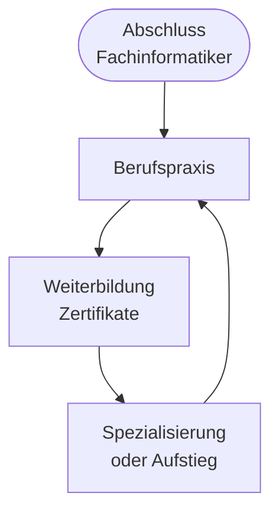

# Kapitel 10 – Lebenslanges Lernen und IT-Karriere

  

  

  

  

  

  

  

  

  

  

<h3>Was du in diesem Kapitel lernst</h3>

- Was lebensbegleitendes Lernen bedeutet und warum es im IT-Bereich besonders wichtig ist
- Wie du persönliche Entwicklungswege reflektierst und planst
- Welche berufliche Aufstiegs- und Weiterbildungsmöglichkeiten Fachinformatiker in allen vier Fachrichtungen haben

---

## So gehst du vor

1. Lies die Kapitelinhalte und skizziere deinen eigenen Entwicklungsweg.
2. Bearbeite die **Kurzübungen** der Reihe nach – von Grundlagen bis Experte.
3. Arbeite die **Workshop-Aufgabe** durch. Sie vertieft das Gelernte an einem zusammenhängenden Szenario.

---

## 10.1 Lebensbegleitendes Lernen

**Lebensbegleitendes Lernen** bedeutet: Lernen endet nicht mit der Abschlussprüfung. In der **IT** ist das zwingend – Technologien, Frameworks und Best Practices ändern sich kontinuierlich.

| Treiber | Beispiel IT |
|---|---|
| Technologiewandel | Cloud, KI, neue Programmiersprachen |
| Regulatorik | DSGVO, IT-Sicherheitsgesetze |
| Karriereziele | Spezialisierung, Führung, Selbstständigkeit |
| Persönliche Entwicklung | Soft Skills, Projektmanagement |

---

## 10.2 Chancen und Anforderungen

| Chancen | Anforderungen |
|---|---|
| Hohe Nachfrage an IT-Fachkräften | Kontinuierliches Lernen |
| Vielfältige Karrierewege | Selbstorganisation, Neugier |
| Remote und internationale Jobs | Sprachen, Kommunikation |
| Gute Verdienstmöglichkeiten | Spezialisierung, Erfahrung |
| Selbstständigkeit möglich | Unternehmerisches Denken |

!!! warning "Obsoleszenz"
    Wissen in der IT **veraltet** schnell. Was heute Standard ist, kann in 5 Jahren überholt sein. **Lernroutine** ist Teil des Berufs.

---

## 10.3 Karrierewege nach Fachrichtung

Alle vier Fachrichtungen teilen den fachrichtungsübergreifenden Kern – die **Spezialisierung** prägt deinen typischen Karrierestart und Weiterbildungsweg.

### Anwendungsentwicklung (AE)

| Stufe | Rolle | Schwerpunkt |
|---|---|---|
| Einstieg | Junior Developer | Programmierung, Bugfixes, kleine Features |
| Fortgeschritten | Software Engineer | Architektur, komplexe Systeme |
| Spezialist | Senior Developer, Tech Lead | Technische Führung, Code-Qualität |
| Alternative | Product Owner, Scrum Master | Schnittstelle Business/IT |
| Aufstieg | IT-Projektleiter, Software Architect | Gesamtplanung, Strategie |

**Weiterbildung:** Cloud-Zertifikate (AWS, Azure), Frameworks, Clean Code, Security, Studium (Informatik, Wirtschaftsinformatik).

### Systemintegration (SI)

| Stufe | Rolle | Schwerpunkt |
|---|---|---|
| Einstieg | IT-Support, Systemadministrator | Helpdesk, Clients, Basis-Netzwerk |
| Fortgeschritten | System Engineer | Server, Virtualisierung, Cloud |
| Spezialist | Netzwerk-Spezialist, Security Engineer | Firewalls, VPN, Hardening |
| Alternative | DevOps Engineer | Automatisierung, CI/CD |
| Aufstieg | IT-Leiter, Infrastructure Architect | Gesamt-IT-Landschaft |

**Weiterbildung:** Cisco/Microsoft/Linux-Zertifikate, ITIL, Cloud, Cybersecurity.

### Daten- und Prozessanalyse (DPA)

| Stufe | Rolle | Schwerpunkt |
|---|---|---|
| Einstieg | Data Analyst, Prozessberater | Daten auswerten, Prozesse dokumentieren |
| Fortgeschritten | Business Analyst, Data Engineer | Datenpipelines, Prozessoptimierung |
| Spezialist | Data Scientist, Process Owner | ML/Analytics, digitale Geschäftsmodelle |
| Alternative | Datenschutzbeauftragter (mit Zusatzqualifikation) | DSGVO, Schutzziele |
| Aufstieg | Head of Analytics, Digital Transformation Manager | Datenstrategie, Optimierung |

**Weiterbildung:** SQL/Python für Analytics, Power BI/Tableau, Prozessmanagement (BPMN), Data-Science-Kurse, Datenschutz-Zertifikate.

### Digitale Vernetzung (DV)

| Stufe | Rolle | Schwerpunkt |
|---|---|---|
| Einstieg | IoT-Techniker, Automatisierungstechniker | Vernetzte Geräte, Sensorik, Basis-PLC |
| Fortgeschritten | IoT Engineer, OT-Spezialist | Industrie 4.0, Edge Computing |
| Spezialist | Vernetzungsarchitekt | Produktions- und Logistiksysteme |
| Alternative | Smart-Factory Consultant | Vernetzung von Prozessen und Produkten |
| Aufstieg | Leiter technische Digitalisierung | Systemverfügbarkeit, Vernetzungsstrategie |

**Weiterbildung:** IoT-Plattformen, industrielle Netzwerke, OPC UA, Automatisierung, IT-Security in OT-Umgebungen.

---

## 10.4 Formen der Weiterbildung

| Form | Beispiel | Dauer / Aufwand |
|---|---|---|
| Kurzseminare | Agile, Scrum | 1–3 Tage |
| Zertifikatslehrgänge | CCNA, AZ-104, LPIC | Wochen bis Monate |
| Fachwirt / Techniker | Gepr. IT-Berufe | 1–2 Jahre neben Beruf |
| Studium | Bachelor Informatik | 3 Jahre (mit Vorkenntnissen verkürzt) |
| Online-Kurse | Udemy, Coursera, Plattform des Arbeitgebers | Flexibel |
| Konferenzen | DevOpsDays, JavaLand | Networking + Trends |

**Finanzierung:** Arbeitgeberzuschuss, Bildungsscheck, Aufstiegs-BAföG, selbst finanziert.

---

## 10.5 Persönlicher Entwicklungsplan

**Reflexionsfragen:**

1. Welche **Stärken** bringe ich aus Vorberuf und Umschulung mit?
2. Welche **Fachrichtung** (AE, SI, DPA, DV) – wo sehe ich mich in 3 Jahren?
3. Welche **3 Skills** brauche ich für den nächsten Schritt?
4. Wer kann mich **mentoren** (Ausbilder, Senior, Community)?
5. Wie messe ich meinen **Fortschritt** (Portfolio, GitHub, Zertifikate)?

| Zeitrahmen | Ziel | Maßnahme |
|---|---|---|
| 6 Monate | Praktikum erfolgreich | Berichtsheft, Projekte dokumentieren |
| 1 Jahr | Abschlussprüfung | Prüfungsvorbereitung, Probeklausuren |
| 2–3 Jahre | Junior-Position | Spezialisierung starten, Zertifikat |
| 5 Jahre | Senior / Spezialist | Führung oder Tiefe |

---

## Kurzübungen

{{ task(file="tasks/tag10_01.yaml") }}

{{ task(file="tasks/tag10_02.yaml") }}

{{ task(file="tasks/tag10_03.yaml") }}

---

## Workshop

{{ task(file="tasks/workshop_k10.yaml") }}
