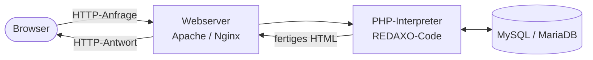
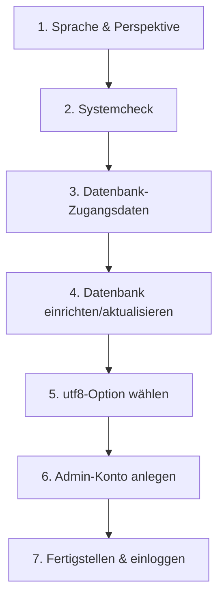

# Kapitel 2 – Installation & Einrichtung

<div class="kurs-progress">
  <div class="step done"></div>
  <div class="step active"></div>
  <div class="step"></div>
  <div class="step"></div>
  <div class="step"></div>
  <div class="step"></div>
  <div class="step"></div>
  <div class="step"></div>
  <div class="step"></div>
  <div class="step"></div>
</div>

<div class="lernziele" markdown>
<h3>Was du in diesem Kapitel lernst</h3>

- Aus welchen Teilen ein **Webserver-Stack** besteht (AMP: Apache/MySQL/PHP) und wie **XAMPP** und **LAMP/LEMP** sich unterscheiden
- Wie du eine lokale Entwicklungsumgebung unter **Windows (XAMPP)** oder in einer **Linux-VM (LAMP/LEMP)** aufsetzt
- Welche **Systemvoraussetzungen** REDAXO 5 hat und wie du sie prüfst
- Wie **Dateirechte** funktionieren und warum sie für Installation und Sicherheit wichtig sind
- Wie die **REDAXO-Setup-Routine** Schritt für Schritt abläuft
- Wie du **Installationsschritte nachvollziehbar dokumentierst**
</div>

---

## 2.1 Der Webserver-Stack (AMP)

Ein CMS wie REDAXO ist ein **PHP-Programm**, das Inhalte aus einer **Datenbank** liest. Damit es läuft, braucht es einen kompletten Software-Stack:

| Buchstabe | Komponente | Aufgabe |
|---|---|---|
| **A** | Webserver (**A**pache oder **N**ginx) | Nimmt Anfragen aus dem Browser entgegen, liefert Antworten |
| **M** | Datenbank (**M**ySQL oder **M**ariaDB) | Speichert Inhalte, Struktur, Benutzer |
| **P** | **P**HP | Führt den CMS-Code aus, erzeugt das HTML |

Je nach Betriebssystem und Webserver spricht man von:

- **XAMPP** – ein fertiges Paket (Apache + MariaDB + PHP + Perl) für **Windows/macOS/Linux**, ideal zum **lokalen Lernen**.
- **LAMP** – **L**inux + **A**pache + **M**ySQL/MariaDB + **P**HP (klassischer Server-Stack).
- **LEMP** – wie LAMP, aber mit **Nginx** (»Engine-X«, daher das **E**) statt Apache.



!!! info "Lokal entwickeln, später live schalten"
    Wir installieren zuerst **lokal** (XAMPP oder VM). Das ist schnell, kostenlos und man kann gefahrlos experimentieren. Der Umzug auf einen echten Webserver (Live-Server) folgt demselben Prinzip – nur mit zusätzlicher Absicherung (Kapitel 10).

---

## 2.2 Systemvoraussetzungen von REDAXO 5

Vor der Installation prüfst du, ob dein System die Anforderungen erfüllt. Für die **aktuelle REDAXO-5-Version** gilt:

| Anforderung | Wert |
|---|---|
| PHP | **8.3+** (aktuelle Version); mind. 8.1 für ältere 5.x-Releases |
| Datenbank | **MySQL ab 5.6** oder **MariaDB ab 10.1** |
| Empfohlen | MySQL ab 5.7.7 / MariaDB ab 10.2 (utf8mb4 – volle Unicode-/Emoji-Unterstützung) |
| PHP-Extensions | `ctype`, `fileinfo`, `gd`, `iconv`, `intl`, `mbstring`, `pdo`, `pdo_mysql`, `pcre`, `session`, `tokenizer` |
| Empfohlen | ImageMagick (als PHP-Extension oder per CLI) für bessere Bildbearbeitung |

!!! tip "Voraussetzungen prüfen"
    - PHP-Version im Terminal: `php -v`
    - Aktive Extensions: `php -m`
    - In XAMPP zeigt das **phpinfo** (über das XAMPP-Dashboard) alle geladenen Extensions.
    Die **REDAXO-Setup-Routine** führt zusätzlich einen automatischen **Systemcheck** durch und warnt, wenn etwas fehlt.

---

## 2.3 Variante A – Installation unter Windows mit XAMPP

=== "1. XAMPP installieren"

    1. XAMPP von der offiziellen Seite herunterladen (Version mit **PHP 8.x**).
    2. Installieren (Standardpfad `C:\xampp`).
    3. **XAMPP Control Panel** öffnen und **Apache** sowie **MySQL** starten.
    4. Test: Im Browser `http://localhost/` aufrufen – die XAMPP-Startseite erscheint.

=== "2. Datenbank anlegen"

    1. Im Control Panel bei MySQL auf **Admin** klicken → **phpMyAdmin** öffnet sich.
    2. Reiter **Datenbanken** → neue **leere** Datenbank anlegen, z. B. `redaxo`.
    3. Kollation **`utf8mb4_general_ci`** wählen.
    4. Zugangsdaten notieren (Host `127.0.0.1`, Benutzer, Passwort, DB-Name) – die Detailkonfiguration (eigener DB-Benutzer mit Minimalrechten) machen wir in Kapitel 3.

=== "3. REDAXO ablegen"

    1. Aktuelle REDAXO-Version von `redaxo.org/download/core/` herunterladen.
    2. ZIP entpacken und den Inhalt in einen neuen Ordner unter dem Webroot legen, z. B. `C:\xampp\htdocs\meinprojekt\`.
    3. Setup im Browser starten: `http://localhost/meinprojekt/redaxo/`.

!!! info "Alternative: REDAXO-Loader"
    Statt das ZIP manuell herunterzuladen, kannst du die Datei `redaxo-loader.php` in den Projektordner legen und im Browser aufrufen – sie lädt den Core automatisch. Im Terminal: `curl -JLO https://redaxo.org/loader`.

---

## 2.4 Variante B – Installation in einer Linux-VM (LAMP/LEMP)

Diese Variante bildet einen **echten Server** realistischer ab. Du richtest z. B. in **VirtualBox** eine VM mit einer Linux-Distribution (z. B. Ubuntu Server) ein.

**LAMP-Stack (Apache) installieren – Beispiel Ubuntu/Debian:**

```bash
sudo apt update
sudo apt install apache2 mariadb-server php php-mysql \
  php-gd php-intl php-mbstring php-curl php-zip php-xml unzip
```

**Datenbank absichern und anlegen:**

```bash
sudo mysql_secure_installation
sudo mysql -u root -p
```

```sql
CREATE DATABASE redaxo CHARACTER SET utf8mb4 COLLATE utf8mb4_general_ci;
```

**REDAXO in das Webverzeichnis legen:**

```bash
cd /var/www/html
sudo curl -JLO https://redaxo.org/loader
```

!!! info "LEMP statt LAMP"
    Für **Nginx** installierst du `nginx` und `php-fpm` statt `apache2` und musst PHP-Anfragen per FastCGI an `php-fpm` weiterleiten sowie eine Rewrite-Regel für „schöne URLs" setzen. Das Prinzip (Webserver → PHP → DB) bleibt gleich; nur die Konfigurationsdateien unterscheiden sich.

Anschließend rufst du das Setup über die IP-Adresse der VM auf: `http://<VM-IP>/redaxo/`.

---

## 2.5 Dateirechte verstehen

Auf **Linux** hat jede Datei einen **Eigentümer**, eine **Gruppe** und **Rechte** für drei Klassen (Eigentümer / Gruppe / Andere), jeweils **r**ead, **w**rite, e**x**ecute:

| Notation | Bedeutung | Typisch für |
|---|---|---|
| `644` | Eigentümer lesen/schreiben, Rest nur lesen | Dateien |
| `755` | Eigentümer alles, Rest lesen/ausführen | Ordner & Skripte |
| `775` / `664` | zusätzlich Schreibrecht für die Gruppe | Ordner, in die der Webserver schreibt |

Der Webserver läuft unter einem eigenen Benutzer (bei Apache/Ubuntu meist `www-data`). Verzeichnisse, in die REDAXO **schreiben** muss – vor allem `redaxo/data/` und `redaxo/cache/` – müssen für diesen Benutzer beschreibbar sein.

```bash
# Eigentümer auf den Webserver-Benutzer setzen
sudo chown -R www-data:www-data /var/www/html
# Ordner 755, Dateien 644 als sichere Standardbasis
sudo find /var/www/html -type d -exec chmod 755 {} \;
sudo find /var/www/html -type f -exec chmod 644 {} \;
```

!!! warning "Rechte-Balance: so eng wie möglich"
    Zu **enge** Rechte → REDAXO kann Cache/Konfiguration nicht schreiben, das Setup schlägt fehl. Zu **weite** Rechte (z. B. `777`) → jeder Prozess auf dem Server darf schreiben, ein **Sicherheitsrisiko**. Ziel: **so viel wie nötig, so wenig wie möglich**. Unter **XAMPP/Windows** spielt das lokal meist keine Rolle – auf dem **Live-Server** ist es aber essenziell (siehe Kapitel 10).

---

## 2.6 Die REDAXO-Setup-Routine

Beim ersten Aufruf von `.../redaxo/` startet der **7-Schritte-Installer**:



1. **Sprache** wählen (Deutsch/Englisch).
2. **Systemcheck**: Der Installer prüft PHP-Version, Extensions und Schreibrechte. Warnungen jetzt beheben!
3. **Datenbank-Zugangsdaten** eingeben: Server (`127.0.0.1`), Datenbankname (`redaxo`), Benutzer, Passwort.
4. **Datenbank einrichten**: Option „Datenbank neu anlegen" wählen (leere DB).
5. **Zeichensatz** wählen (utf8mb4, wenn unterstützt).
6. **Administrator-Konto** anlegen: Benutzername + **sicheres Passwort** (mind. 8 Zeichen, Groß-/Kleinbuchstaben, Zahlen, Sonderzeichen).
7. **Fertigstellen** – anschließend am Backend einloggen.

!!! tip "Basisdemo als Lern-Startpunkt"
    REDAXO bringt über das AddOn **`Installer`** Demo-Websites mit. Die **`demo_base` (Basisdemo)** ist vollständig übersetzt und zeigt Templates, Module und Struktur an einem echten Beispiel – ideal zum Nachvollziehen, wie eine REDAXO-Seite aufgebaut ist.

---

## 2.7 Installation nachvollziehbar dokumentieren

Zu einer professionellen Installation gehört die **Dokumentation**. Sie ermöglicht es, die Installation zu wiederholen, Fehler zu finden und im Team zu arbeiten. Eine gute Installations-Doku enthält mindestens:

| Abschnitt | Inhalt |
|---|---|
| Umgebung | Betriebssystem, Stack (XAMPP/LAMP/LEMP), Versionen (PHP, DB, REDAXO) |
| Voraussetzungen | Geprüfte Extensions, Ergebnis des Systemchecks |
| Schritte | Nummerierte Abfolge inkl. ausgeführter Befehle |
| Datenbank | DB-Name, Benutzer, Host (Passwörter **nicht** im Klartext ablegen!) |
| Dateirechte | Gesetzte Eigentümer/Rechte für schreibbare Ordner |
| Zugänge | Backend-URL, Admin-Benutzername (Passwort separat/sicher) |
| Besonderheiten | Abweichungen, aufgetretene Fehler und deren Lösung |

!!! warning "Keine Passwörter im Klartext dokumentieren"
    Dokumentiere **Benutzernamen** und **welche** Zugangsdaten existieren, aber lege **Passwörter** in einem **Passwort-Manager** ab – nicht in der Doku oder im Projektordner. Mehr zu Zugangs-Hygiene in Kapitel 10.

---

## Kurzübungen

{{ task(file="tasks/kapitel2_01.yaml") }}

{{ task(file="tasks/kapitel2_02.yaml") }}

{{ task(file="tasks/kapitel2_03.yaml") }}

---

## Workshop

{{ task(file="tasks/workshop_k2.yaml") }}
