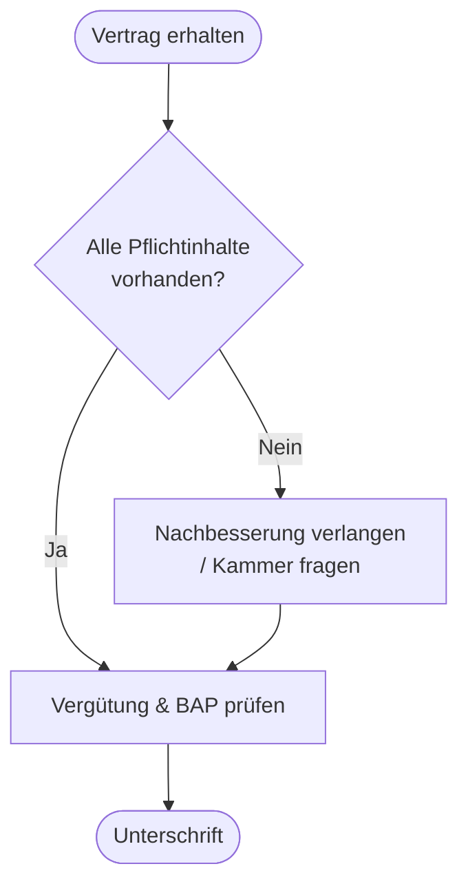

# Kapitel 2 – Ausbildungsvertrag

  

  

  

  

  

  

  

  

  

  

<h3>Was du in diesem Kapitel lernst</h3>

- Welche wesentlichen Inhalte ein Ausbildungsvertrag hat und welche Pflichtbestandteile gesetzlich vorgeschrieben sind
- Welche Rechte und Pflichten Auszubildende, Ausbildungsbetrieb und Beteiligte haben
- Wie du Vertragsinhalte auf deinen späteren Praktikumsbetrieb überträgst – auch wenn der Betrieb zu Beginn noch nicht feststeht

---

## So gehst du vor

1. Lies die Kapitelinhalte und merke dir die Pflichtinhalte des Ausbildungsvertrags.
2. Bearbeite die **Kurzübungen** der Reihe nach – von Grundlagen bis Experte.
3. Arbeite die **Workshop-Aufgabe** durch. Sie vertieft das Gelernte an einem zusammenhängenden Szenario.

---

## 2.1 Was ist ein Ausbildungsvertrag?

Der **Ausbildungsvertrag** ist die rechtliche Grundlage der Berufsausbildung. Er wird zwischen dem **Ausbildungsbetrieb** (Arbeitgeber) und der **Auszubildenden Person** geschlossen. Er regelt Dauer, Vergütung, Lernziele und die Pflichten beider Seiten.

**Rechtsgrundlage:** Berufsbildungsgesetz (BBiG), insbesondere § 10–16.

Der Vertrag muss **schriftlich** festgehalten werden. Beide Parteien erhalten eine Ausfertigung. Die Kammer (z. B. IHK) wird über den Vertrag informiert.

---

## 2.2 Pflichtinhalte des Ausbildungsvertrags

Nach § 11 BBiG muss der Ausbildungsvertrag mindestens folgende Angaben enthalten:

| Pflichtinhalt | Beispiel / Erklärung |
|---|---|
| Name und Anschrift der Vertragsparteien | Betrieb, Auszubildende Person |
| Beginn und Dauer der Ausbildung | z. B. 01.09.2026, 2 Jahre |
| Art der Ausbildung | Fachinformatiker mit Fachrichtung (AE, SI, DPA oder DV) |
| Ausbildungsstätte | Betriebsstandort, ggf. weitere Orte |
| Ausbildungsvergütung | Betrag und Staffelung nach Ausbildungsjahr |
| Kündigungsfristen | Besondere Regeln im BBiG |
| Hinweis auf Tarifverträge / Betriebsvereinbarungen | Falls anwendbar |
| Hinweis auf betrieblichen Ausbildungsplan | BAP muss erstellt und vorgelegt werden |

!!! warning "Prüfungstipp"
    Fehlen **wesentliche Pflichtinhalte**, kann der Vertrag unwirksam sein. Die Kammer prüft Verträge und kann Nachbesserung verlangen.

---

## 2.3 Rechte der Auszubildenden Person

| Recht | Kurz erklärt |
|---|---|
| Anspruch auf Ausbildung | Betrieb muss alle Inhalte der Ausbildungsordnung vermitteln |
| Ausbildungsvergütung | Mindestvergütung nach BBiG; Tarif kann höhere Beträge vorsehen |
| Berufsschulunterricht | Anwesenheit im Pflichtunterricht; Betrieb darf nicht ohne Zustimmung abhalten |
| Urlaub | Gesetzlicher Mindesturlaub: 24 Werktage bei 6-Tage-Woche (= 20 Arbeitstage bei 5-Tage-Woche); für unter 18-Jährige mehr (JArbSchG) |
| Kündigungsschutz | Besondere Kündigungsbeschränkungen in den ersten Jahren |
| Zeugnis | Anspruch auf Ausbildungszeugnis bei Beendigung |
| Mitbestimmung | Beteiligung über Jugend- und Auszubildendenvertretung (JAV), falls vorhanden |

---

## 2.4 Pflichten der Auszubildenden Person

| Pflicht | Kurz erklärt |
|---|---|
| Lernpflicht | Ernsthaft und regelmäßig lernen, Anleitung nutzen |
| Befolgen von Anweisungen | Im Rahmen der Ausbildung und unter Aufsicht |
| Sorgfalt | Schäden am Betriebsvermögen vermeiden |
| Schweigepflicht | Über Geschäfts- und Betriebsgeheimnisse |
| Berufsschulpflicht | Regelmäßiger Unterricht besuchen |
| Ausbildungsnachweise | Berichtsheft / digitale Nachweise führen |

!!! tip "Berichtsheft"
    Das **Berichtsheft** (oder digitale Alternative) dokumentiert deine Ausbildungstätigkeiten. Es ist Prüfungsvoraussetzung und wichtiges Nachweisdokument für die Kammer.

---

## 2.5 Pflichten des Ausbildungsbetriebs

| Pflicht | Kurz erklärt |
|---|---|
| Ausbildungsgeeignetheit | Tätigkeiten und Ausstattung müssen passen |
| Ausbildungsplan | Betrieblicher Ausbildungsplan (BAP) erstellen und abstimmen |
| Anleitung | Ausgebildete, geeignete Ausbilder einsetzen |
| Vergütung zahlen | Mindestens gesetzliche Ausbildungsvergütung |
| Freistellung Berufsschule | Für Pflichtunterricht und Prüfungen |
| Zeugnis erteilen | Bei Beendigung der Ausbildung |

---

## 2.6 Übertragung auf das Umschüler-Praktikum

Die Regeln des Ausbildungsvertrags gelten für das **reguläre Ausbildungsverhältnis**. Als Umschüler schließt du mit dem Praktikumsbetrieb dagegen einen **Praktikumsvertrag** – **unbezahlt** und mit anderem Inhalt. Vieles lässt sich aber übertragen:

- **Klare Eckdaten:** Beginn, Dauer, Einsatzbereich und Ansprechperson schriftlich festhalten
- **Ziele und Nachweise:** Was sollst du lernen, wie wird es dokumentiert (Abstimmung mit dem Bildungsträger)?
- **Checklisten-Denken:** Wie beim Ausbildungsvertrag alle wichtigen Punkte vor Unterschrift prüfen
- **Beratung nutzen:** Bildungsträger (und ggf. Kammer) fragen, wenn etwas unklar ist

!!! info "Ausbildungsvertrag ≠ Praktikumsvertrag"
    Ausbildungsvertrag, Ausbildungsvergütung und betrieblicher Ausbildungsplan gehören zum **Ausbildungsverhältnis** eines Azubis. Dein Umschüler-Praktikum ist unbezahlt und ohne Ausbildungsvertrag – die Vertragsinhalte lernst du hier trotzdem, weil sie Prüfungsstoff sind und für dein späteres Beschäftigungsverhältnis gelten.

---

## Kurzübungen

{{ task(file="tasks/tag2_01.yaml") }}

{{ task(file="tasks/tag2_02.yaml") }}

{{ task(file="tasks/tag2_03.yaml") }}

---

## Workshop

{{ task(file="tasks/workshop_k2.yaml") }}
