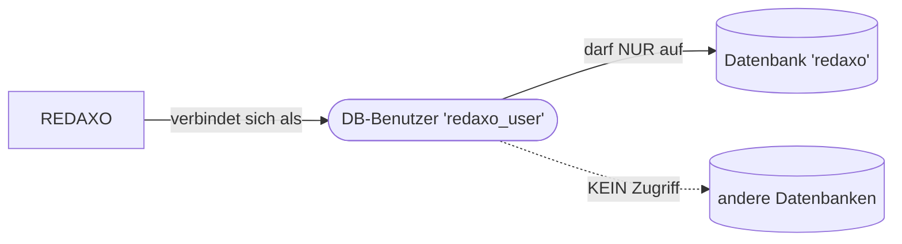
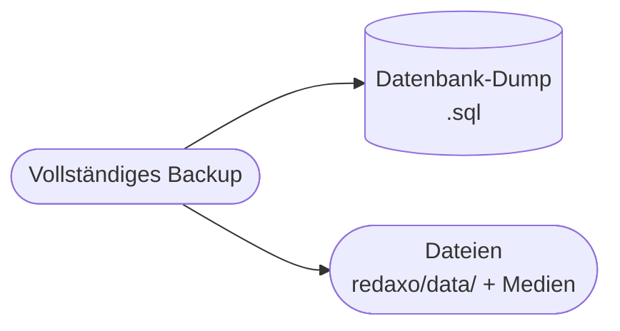

# Kapitel 3 – Datenbank & Konfiguration

<div class="kurs-progress">
  <div class="step done"></div>
  <div class="step done"></div>
  <div class="step active"></div>
  <div class="step"></div>
  <div class="step"></div>
  <div class="step"></div>
  <div class="step"></div>
  <div class="step"></div>
  <div class="step"></div>
  <div class="step"></div>
</div>

<div class="lernziele" markdown>
<h3>Was du in diesem Kapitel lernst</h3>

- Welche Rolle die **Datenbank** in einem CMS spielt und wie REDAXO sie nutzt
- Wie du ein **Datenbank-Schema** und einen **eigenen DB-Benutzer mit Minimalrechten** anlegst
- Warum das **Least-Privilege-Prinzip** die Sicherheit erhöht
- Wo REDAXO seine **Konfiguration** speichert (`config.yml`, Tabellen-Präfix) und wie du sie nachvollziehbar pflegst
- Wie du **Backups** der Datenbank planst und wiederherstellst
</div>

---

## 3.1 Die Datenbank als Herz des CMS

In Kapitel 1 hast du gelernt: Ein CMS trennt **Inhalt** von **Darstellung**. Der **Inhalt** liegt in der **Datenbank**. REDAXO speichert dort u. a.:

| Was | Beispiel-Tabelle (Präfix `rex_`) |
|---|---|
| Struktur (Kategorien/Artikel) | `rex_article` |
| Inhaltsblöcke (Slices) | `rex_article_slice` |
| Templates & Module | `rex_template`, `rex_module` |
| Medienpool-Metadaten | `rex_media`, `rex_media_category` |
| Benutzer & Rechte | `rex_user`, `rex_user_role` |
| Konfiguration/AddOns | `rex_config` |

!!! info "Datei vs. Datenbank"
    Nicht alles liegt in der DB: **Medien-Dateien** (Bilder, PDFs) liegen als Dateien im Ordner `redaxo/data/addons/media_manager/` bzw. im Medienpool-Verzeichnis; die **Datenbank** speichert nur die **Metadaten** (Dateiname, Titel, Kategorie). Ein vollständiges Backup umfasst deshalb **DB + Dateien** (dazu Abschnitt 3.5 und Kapitel 8).

**Das Tabellen-Präfix** (Standard `rex_`) wird jeder Tabelle vorangestellt. Es erlaubt, **mehrere Anwendungen in einer Datenbank** zu betreiben, und erschwert automatisierten Angriffen das Raten von Tabellennamen.

---

## 3.2 Schema und Benutzer trennen

Bei der Installation (Kapitel 2) haben wir uns oft noch mit dem **root**-Benutzer verbunden. Für den **Betrieb** ist das ein Fehler: Das CMS sollte einen **eigenen Datenbank-Benutzer** verwenden, der **nur auf seine eine Datenbank** und **nur mit den nötigen Rechten** zugreifen darf.



**Trennung von:**

- **Schema** (die Datenbank `redaxo` – der „Behälter" für die Tabellen)
- **Benutzer** (`redaxo_user` – das Konto, mit dem sich REDAXO verbindet)

So kann ein kompromittiertes CMS **nicht** auf andere Datenbanken zugreifen, und `root` bleibt aus der Anwendung heraus unerreichbar.

---

## 3.3 Minimalrechte vergeben (Least Privilege)

Das **Least-Privilege-Prinzip** bedeutet: Ein Konto bekommt **nur die Rechte, die es wirklich braucht** – nicht mehr. REDAXO braucht im Normalbetrieb Rechte, um Daten zu **lesen, schreiben, ändern, löschen** und (bei Installationen/Updates) **Tabellen anzulegen/zu ändern**.

**Beispiel: eigener Benutzer mit passenden Rechten (MySQL/MariaDB):**

```sql
-- Eigenen Benutzer anlegen (nur von localhost erreichbar)
CREATE USER 'redaxo_user'@'localhost' IDENTIFIED BY 'EinStarkesPasswort!';

-- Nur Rechte auf die EINE Datenbank 'redaxo' vergeben
GRANT SELECT, INSERT, UPDATE, DELETE,
      CREATE, ALTER, DROP, INDEX, LOCK TABLES
  ON redaxo.* TO 'redaxo_user'@'localhost';

FLUSH PRIVILEGES;
```

| Recht | Wofür REDAXO es braucht |
|---|---|
| `SELECT` | Inhalte lesen (jeder Seitenaufruf) |
| `INSERT`, `UPDATE`, `DELETE` | Inhalte pflegen (Redaktion) |
| `CREATE`, `ALTER`, `DROP`, `INDEX` | AddOn-Installation & Updates (Tabellen anlegen/ändern) |
| `LOCK TABLES` | Backup/Import konsistent durchführen |

!!! warning "Was NICHT vergeben wird"
    **Keine** globalen Rechte (`ON *.*`), **kein** `GRANT OPTION`, **kein** `SUPER`, **kein** `FILE`. Der Benutzer darf ausschließlich `redaxo.*` – nicht andere Datenbanken. So bleibt der Schaden bei einer Kompromittierung auf diese eine Datenbank begrenzt.

!!! tip "Zwei Rechtestufen in der Praxis"
    Manche Teams vergeben für den **Betrieb** nur `SELECT, INSERT, UPDATE, DELETE` und schalten `CREATE/ALTER/DROP` **nur temporär** für Updates frei. Das ist sicherer, aber aufwändiger. Für den Kurs genügt das obige Rechteset.

---

## 3.4 Wo REDAXO seine Konfiguration speichert

REDAXO legt die zentralen Einstellungen in einer **YAML-Datei** ab:

```
redaxo/data/core/config.yml
```

Darin stehen u. a. die **Datenbank-Zugangsdaten**, das **Tabellen-Präfix** und der **Instanzname**:

```yaml
instname: rex...
server: 'http://localhost/meinprojekt/'
servername: 'Meine REDAXO-Seite'
lang: de_de
timezone: Europe/Berlin
setup: false
db:
  1:
    host: 127.0.0.1
    login: redaxo_user
    password: '********'
    name: redaxo
    persistent: false
table_prefix: rex_
```

!!! warning "config.yml enthält Zugangsdaten – schützen!"
    Diese Datei enthält das **DB-Passwort im Klartext**. Sie liegt im Ordner `redaxo/data/`, der **nicht öffentlich erreichbar** sein darf. REDAXO schützt `redaxo/data/` per `.htaccess`; auf Nginx musst du das in der Serverkonfiguration selbst absichern (Kapitel 10). **Niemals** `config.yml` in ein öffentliches Git-Repository committen.

**Weitere Konfiguration** (z. B. AddOn-Einstellungen) speichert REDAXO in der Tabelle `rex_config` bzw. den `config.yml`-Dateien der jeweiligen AddOns. Das AddOn **phpMyAdmin** oder **Adminer** (als AddOn verfügbar) hilft, direkt in die Datenbank zu schauen.

**Nachvollziehbar pflegen** heißt:

- Änderungen an Konfiguration **dokumentieren** (was, warum, wann).
- Zwischen **Entwicklungs-** und **Live-Konfiguration** unterscheiden (andere DB-Zugänge, `debug`-Modus nur lokal an).
- Konfigurationsdateien versionieren – aber **Secrets** (Passwörter) auslassen (`.gitignore`).

---

## 3.5 Backups planen

Ein Backup ist nur dann etwas wert, wenn man es **regelmäßig** erstellt **und** die **Wiederherstellung** getestet hat. Zu einem vollständigen REDAXO-Backup gehören **zwei Teile**:



**Datenbank-Dump per Kommandozeile:**

```bash
# Sichern
mysqldump -u redaxo_user -p redaxo > backup_redaxo_2026-07-05.sql

# Wiederherstellen (in eine leere DB)
mysql -u redaxo_user -p redaxo < backup_redaxo_2026-07-05.sql
```

**Innerhalb von REDAXO** gibt es das AddOn **`Backup`** (früher „phpMyBackupPro"/Kern-Werkzeug), mit dem sich Datenbank-Exporte und -Importe bequem im Backend erstellen lassen – auch **zeitgesteuert** über das **`cronjob`**-AddOn.

| Backup-Regel | Warum |
|---|---|
| **3-2-1-Regel**: 3 Kopien, 2 Medien, 1 außer Haus | Schutz vor Hardware- und Standort-Ausfall |
| **Vor jedem Update** ein Backup | Rollback möglich, falls das Update scheitert (Kapitel 8) |
| **Restore testen** | Ein nie getestetes Backup ist kein Backup |
| **Dateien + DB gemeinsam** sichern | Beide gehören zu einem konsistenten Stand |

!!! tip "Namenskonvention für Backups"
    Nutze sprechende Dateinamen mit **Datum** (`backup_projekt_JJJJ-MM-TT.sql`). So findest du im Notfall schnell den richtigen Stand. Mehr zum Thema **Restore & Notfall** in Kapitel 10.

---

## Kurzübungen

{{ task(file="tasks/kapitel3_01.yaml") }}

{{ task(file="tasks/kapitel3_02.yaml") }}

{{ task(file="tasks/kapitel3_03.yaml") }}

---

## Workshop

{{ task(file="tasks/workshop_k3.yaml") }}
