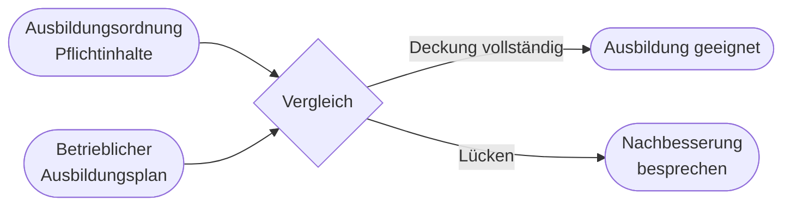

# Kapitel 3 – Ausbildungsplan und Ausbildungsordnung

  

  

  

  

  

  

  

  

  

  

<h3>Was du in diesem Kapitel lernst</h3>

- Was eine Ausbildungsordnung ist und welche Rolle sie für den Fachinformatiker spielt
- Was ein betrieblicher Ausbildungsplan (BAP) enthält und wie er erstellt wird
- Wie du den BAP mit der Ausbildungsordnung vergleichst und Abweichungen erkennst

---

## So gehst du vor

1. Lies die Kapitelinhalte und verstehe den Zusammenhang zwischen Ordnung, Plan und Prüfung.
2. Bearbeite die **Kurzübungen** der Reihe nach – von Grundlagen bis Experte.
3. Arbeite die **Workshop-Aufgabe** durch. Sie vertieft das Gelernte an einem zusammenhängenden Szenario.

---

## 3.1 Die Ausbildungsordnung

Die **Ausbildungsordnung** wird vom zuständigen Bundesministerium im Einvernehmen mit dem Bundesinstitut für Berufsbildung (BIBB) erlassen. Sie definiert:

- **Berufsprofil** und Handlungsfähigkeit am Ende der Ausbildung
- **Ausbildungsdauer** (Fachinformatiker: in der Regel 3 Jahre; in der Umschulung oft verkürzt auf 2 Jahre bei entsprechender Qualifikation)
- **Ausbildungsinhalte** in Form von vier Fachrichtungen (AE, SI, DPA, DV) und Qualifikationsbausteinen
- **Prüfungsanforderungen** (Teil 1 und Teil 2 der Abschlussprüfung)

Für den **Fachinformatiker** gibt es eine aktuelle Ausbildungsordnung mit gemeinsamen und fachrichtungsspezifischen Inhalten.

| Dokument | Zweck |
|---|---|
| Ausbildungsordnung | Gesetzliche Mindestanforderungen für alle Betriebe |
| Rahmenlehrplan | Unterrichtsinhalte in der Berufsschule / beim Bildungsträger |
| Betrieblicher Ausbildungsplan (BAP) | Konkrete Umsetzung im einzelnen Betrieb |

---

## 3.2 Der betriebliche Ausbildungsplan (BAP)

Der **betriebliche Ausbildungsplan** legt fest, **wann** und **wo** im Betrieb welche Inhalte der Ausbildungsordnung vermittelt werden. Er wird vom Betrieb erstellt – oft in Abstimmung mit der Kammer und dem Ausbilder.

**Typische Bestandteile eines BAP:**

| Bestandteil | Inhalt |
|---|---|
| Ausbildungsziele | Welche Kompetenzen am Ende erreicht werden sollen |
| Zeitliche Gliederung | Ausbildungsjahre, Rotation zwischen Abteilungen |
| Lernorte im Betrieb | z. B. IT-Support, Entwicklung, Netzwerk |
| Ausbildungsmethoden | Anleitung, Projektarbeit, Schulungen |
| Verantwortliche Personen | Ausbilder, Mentoren |
| Abstimmung mit Ausbildungsordnung | Explizite Zuordnung der Qualifikationsbausteine |

!!! info "BAP vor Vertragsbeginn"
    Der BAP muss der Auszubildenden Person **vor Beginn** oder zu Beginn der Ausbildung vorgelegt werden. Du hast Anspruch darauf, ihn zu kennen und zu verstehen.

---

## 3.3 Vergleich: Ausbildungsordnung und BAP

Der Vergleich ist wichtig, um zu prüfen, ob der Betrieb alle **gesetzlich vorgeschriebenen Inhalte** abdeckt.

**Vorgehen beim Vergleich:**

1. **Ausbildungsordnung** besorgen (IHK, BIBB-Website)
2. **Qualifikationsbausteine** und Fachrichtungsinhalte auflisten
3. **BAP** des Betriebs Zeile für Zeile durchgehen
4. **Lücken** identifizieren: Welche Inhalte fehlen oder sind nur unzureichend geplant?
5. **Ergänzungen** besprechen: z. B. externe Schulungen, Berufsschule, Projekte

**Beispiel Fachinformatiker AE:**

| Inhalt laut Ordnung (Auswahl) | Im BAP geplant? |
|---|---|
| Programmiersprachen und Entwicklungsumgebungen | z. B. Java-Projekt in Jahr 1 |
| Datenbanken modellieren und nutzen | z. B. SQL-Schulung + Praxis |
| Software testen | z. B. QA-Rotation |
| Kundenberatung / Anforderungsanalyse | z. B. Support-Rotation |

---

## 3.4 Rolle in der Umschulung

Der **betriebliche Ausbildungsplan** gehört zum regulären **Ausbildungsverhältnis** eines Azubis. In der Umschulung übernimmt der **Bildungsträger** die theoretischen Inhalte des Rahmenlehrplans; dein **Betriebspraktikum** liefert die praktische Erfahrung – auch ohne formalen BAP.

- Unterricht beim Träger ≠ vollständige betriebliche Praxis
- Für die **Abschlussprüfung** brauchst du praktische Erfahrung in relevanten Bereichen
- Nutze das Praktikum gezielt, um Inhalte der Ausbildungsordnung praktisch abzudecken

!!! tip "Eigeninitiative"
    Vergleiche die **Ausbildungsordnung** mit dem, was du im Unterricht und im Praktikum tatsächlich machst. Bei Lücken: mit Bildungsträger und Praktikumsbetrieb sprechen und gezielt Aufgaben oder Zusatzprojekte vereinbaren.

---

## Kurzübungen

{{ task(file="tasks/tag3_01.yaml") }}

{{ task(file="tasks/tag3_02.yaml") }}

{{ task(file="tasks/tag3_03.yaml") }}

---

## Workshop

{{ task(file="tasks/workshop_k3.yaml") }}
