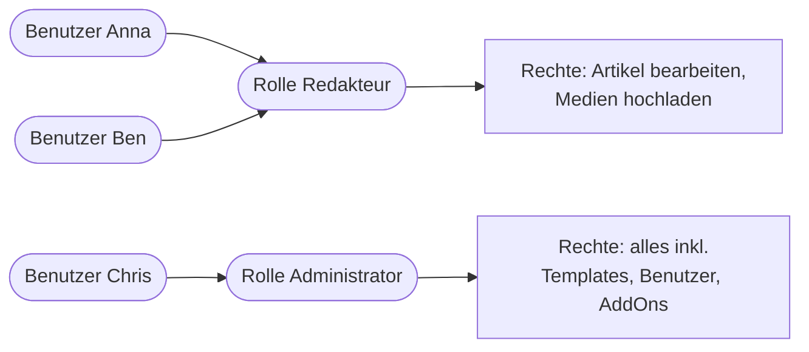
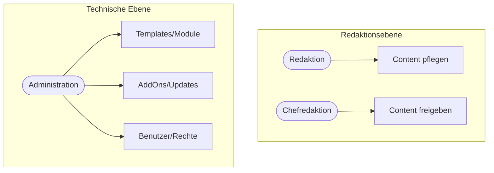

# Kapitel 4 – Benutzer, Rollen & Rechte

  

  

  

  

  

  

  

  

  

  

<h3>Was du in diesem Kapitel lernst</h3>

- Warum ein CMS **Benutzer, Rollen und Rechte** trennt und was das mit Sicherheit zu tun hat
- Wie REDAXO zwischen **Administrator** und **rollenbasierten Benutzern** unterscheidet
- Wie du in REDAXO **Rollen** anlegst und Rechte auf Struktur, Medienpool und Module vergibst
- Was der Unterschied zwischen **Redaktion** und **Administration** ist
- Wie du eine **Rollenrichtlinie** für die Content-Pflege formulierst und umsetzt

---

## 4.1 Warum Benutzer, Rollen und Rechte trennen?

In Kapitel 1 gab es das Beispiel „ohne CMS kann jeder mit FTP-Zugang alles überschreiben". Ein CMS löst das über ein **Berechtigungssystem**. Drei Begriffe musst du sauber unterscheiden:

| Begriff | Bedeutung | Beispiel |
|---|---|---|
| **Benutzer** | Eine konkrete Person mit Login | `anna.mueller` |
| **Rolle** | Ein Bündel von Rechten, das man Benutzern zuweist | „Redakteur", „Administrator" |
| **Recht** | Eine einzelne erlaubte Aktion | „darf Artikel in Kategorie X bearbeiten" |

!!! info "Warum nicht jedem alles erlauben?"
    Das **Least-Privilege-Prinzip** (aus Kapitel 3) gilt auch für Menschen: Wer nur Texte pflegt, braucht **keinen** Zugriff auf Templates, AddOns oder Benutzerverwaltung. Weniger Rechte bedeuten **weniger Schaden** durch Versehen **und** durch ein gekapertes Konto.

---

## 4.2 Das REDAXO-Rechtekonzept

REDAXO unterscheidet grundsätzlich zwei Arten von Backend-Benutzern:

| Typ | Beschreibung |
|---|---|
| **Administrator** (Admin-Flag) | Hat **uneingeschränkten** Zugriff auf **alles** – Struktur, Templates, Module, AddOns, Benutzerverwaltung, Systemeinstellungen. Rollen werden ignoriert. |
| **Benutzer mit Rolle(n)** | Sieht und darf **nur**, was die zugewiesene(n) **Rolle(n)** erlauben. |

Eine **Rolle** in REDAXO bündelt Rechte in mehreren Bereichen:

- **Allgemeine Rechte / Module (Perm):** Welche Backend-Menüpunkte/AddOns sichtbar sind (z. B. Struktur, Medienpool, MetaInfo).
- **Struktur-Rechte:** Auf **welche Kategorien** (Seitenbaum) der Benutzer zugreifen darf.
- **Medienpool-Rechte:** Auf welche **Medienkategorien** und ob er hochladen/löschen darf.
- **Sprach-Rechte (clang):** In welchen Sprachversionen er arbeiten darf (siehe Kapitel 6).

!!! warning "Admin-Konten sparsam einsetzen"
    Das **Admin-Flag** überschreibt alle Rollen und Einschränkungen. Es sollte nur **wenigen, technisch verantwortlichen** Personen gehören. Für die tägliche Redaktion nutzt man **niemals** ein Admin-Konto – das ist wie „immer als root arbeiten".

---

## 4.3 Rollen in REDAXO anlegen

Der Weg im Backend: **System → Benutzer → Rollen** (Reiter *Rollen*).

=== "Rolle anlegen"

    1. Neue Rolle erstellen, z. B. „Redaktion".
    2. **Allgemeine Rechte / Module** auswählen: nur die AddOns, die die Rolle sehen soll (z. B. `structure`, `mediapool`).
    3. **Struktur:** die Kategorien markieren, die diese Rolle bearbeiten darf (oder „alle").
    4. **Medienpool:** erlaubte Medienkategorien + Upload-/Löschrechte.
    5. **Sprachen (clang):** erlaubte Sprachversionen.
    6. Speichern.

=== "Benutzer zuweisen"

    1. **System → Benutzer** → Benutzer anlegen/bearbeiten.
    2. Benutzername, sicheres Passwort, ggf. E-Mail.
    3. **Rolle(n)** zuweisen (mehrere möglich – die Rechte addieren sich).
    4. Das **Admin-Flag** bewusst **nicht** setzen.
    5. Speichern.

!!! tip "Rechte kumulieren"
    Ein Benutzer kann **mehrere Rollen** haben; die Rechte werden **addiert**. So kannst du kleine, klar benannte Rollen bauen (z. B. „Redaktion News", „Medien-Upload") und sie kombinieren, statt eine große unübersichtliche Rolle zu pflegen.

---

## 4.4 Redaktion vs. Administration

In der Praxis reichen meist wenige, klar geschnittene Rollen. Ein bewährtes Grundmodell:

| Rolle | Darf | Darf nicht |
|---|---|---|
| **Redaktion** | Artikel/Seiten in zugewiesenen Kategorien erstellen & bearbeiten, Medien hochladen, veröffentlichen | Templates/Module ändern, Benutzer verwalten, AddOns installieren |
| **Chefredaktion / Freigabe** | wie Redaktion + Inhalte anderer prüfen & freigeben, Struktur anlegen | System-/Sicherheitseinstellungen |
| **Administration** | Alles: Templates, Module, AddOns, Benutzer, System | – (volle Verantwortung) |

!!! info "Trennung von Inhalt und Technik"
    Diese Rollentrennung spiegelt die **Trennung von Inhalt und Darstellung** aus Kapitel 1 auf der **Personen-Ebene** wider: Redakteure kümmern sich um Inhalte, Administratoren um Technik/Design. Das reduziert Fehler und macht Verantwortlichkeiten klar.

---

## 4.5 Eine Rollenrichtlinie formulieren

Eine **Rollenrichtlinie** (Policy) hält schriftlich fest, **welche Rollen** es gibt, **wer** sie bekommt und **was** sie dürfen. Sie ist die Grundlage für nachvollziehbare, prüfbare Rechtevergabe.

**Bestandteile einer Rollenrichtlinie:**

1. **Rollenkatalog** – Liste aller Rollen mit Kurzbeschreibung.
2. **Rechtematrix** – Tabelle: Rolle × Berechtigung (darf / darf nicht).
3. **Vergabeprozess** – Wer beantragt, wer genehmigt, wer legt an?
4. **Onboarding/Offboarding** – Konten anlegen bei Eintritt, **deaktivieren/löschen** bei Austritt.
5. **Regelmäßige Prüfung** – Rechte periodisch kontrollieren („brauchst du das noch?").

**Beispiel-Rechtematrix (Ausschnitt):**

| Berechtigung | Redaktion | Chefredaktion | Administration |
|---|:---:|:---:|:---:|
| Artikel bearbeiten (eigene Kategorie) | ✅ | ✅ | ✅ |
| Artikel veröffentlichen | ✅ | ✅ | ✅ |
| Struktur/Kategorien ändern | ❌ | ✅ | ✅ |
| Medien hochladen | ✅ | ✅ | ✅ |
| Templates/Module bearbeiten | ❌ | ❌ | ✅ |
| Benutzer/Rollen verwalten | ❌ | ❌ | ✅ |
| AddOns installieren/updaten | ❌ | ❌ | ✅ |

!!! warning "Offboarding nicht vergessen"
    Verwaiste Konten ausgeschiedener Mitarbeiter sind ein **Sicherheitsrisiko**. Deaktiviere Konten sofort bei Austritt. In REDAXO kannst du Benutzer **deaktivieren** (Login gesperrt), ohne ihre Inhalte/Zuordnungen zu verlieren.

---

## Kurzübungen

{{ task(file="tasks/kapitel4_01.yaml") }}

{{ task(file="tasks/kapitel4_02.yaml") }}

{{ task(file="tasks/kapitel4_03.yaml") }}

---

## Workshop

{{ task(file="tasks/workshop_k4.yaml") }}
