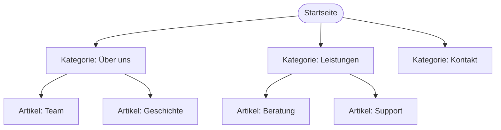
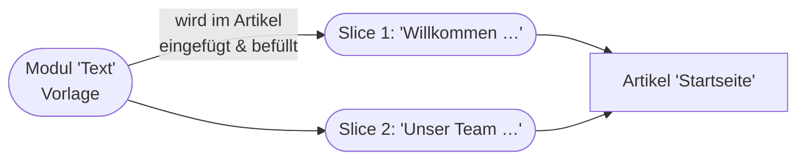
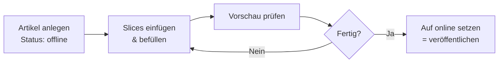
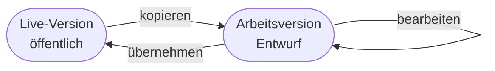

# Kapitel 5 – Frontend, Backend & Workflows

<div class="kurs-progress">
  <div class="step done"></div>
  <div class="step done"></div>
  <div class="step done"></div>
  <div class="step done"></div>
  <div class="step active"></div>
  <div class="step"></div>
  <div class="step"></div>
  <div class="step"></div>
  <div class="step"></div>
  <div class="step"></div>
</div>

<div class="lernziele" markdown>
<h3>Was du in diesem Kapitel lernst</h3>

- Wie REDAXO die **Struktur** einer Website aus **Kategorien** und **Artikeln** aufbaut
- Was **Templates**, **Module** (Eingabe/Ausgabe) und **Slices** sind und wie sie zusammenspielen
- Wie du mit **REX-Variablen** Inhalte in Templates und Modulen ausgibst
- Wie der Workflow **Erstellen → Veröffentlichen** über den **Online/Offline-Status** funktioniert
- Wie du mit **Arbeitsversion/Live-Version** und dem **History-AddOn** versionierst
- Was gute **Editor-Workflows** in der Redaktion ausmachen
</div>

---

## 5.1 Struktur: Kategorien und Artikel

Die **Struktur** ist der Seitenbaum deiner Website. REDAXO kennt zwei Bausteine:

| Element | Rolle | Vergleich |
|---|---|---|
| **Kategorie** | Gruppiert Artikel und Unterkategorien (Ordner im Baum) | Ordner |
| **Artikel** | Die einzelne Seite mit Inhalt | Datei/Seite |

Jede Kategorie hat einen **Startartikel**; weitere Artikel liegen darunter. Aus diesem Baum entsteht später auch die **Navigation** der Website.



Im Backend findest du das unter **Struktur**. Jeder Artikel und jede Kategorie hat eine **ID** (z. B. Artikel 5). Über diese ID verlinkt und referenziert REDAXO Inhalte intern.

!!! info "Artikel = Seite, Beitrag oder Datensatz"
    In REDAXO ist der **Artikel** das universelle Seiten-Objekt – egal ob Startseite, „Über uns", ein News-Beitrag oder eine Landingpage. Was ein Artikel **anzeigen** kann, bestimmt sein **Template** und seine **Slices**.

---

## 5.2 Templates – das HTML-Gerüst

Ein **Template** ist das **HTML-Grundgerüst** einer Seite: `<head>`, Kopfbereich, Navigation, der Platz für den Inhalt und die Fußzeile. Jedem Artikel wird **ein Template** zugewiesen.

Im Template stehen **REX-Variablen** als Platzhalter, die REDAXO beim Aufruf durch echte Inhalte ersetzt:

```html
<!DOCTYPE html>
<html lang="de">
<head>
    <meta charset="utf-8">
    <meta name="viewport" content="width=device-width, initial-scale=1">
    <title>REX_ARTICLE_NAME</title>
    <link rel="stylesheet" href="/assets/css/style.css">
</head>
<body>
    <header>Mein Firmenlogo</header>

    <nav>
        <!-- Navigation z. B. per rex_navigation -->
    </nav>

    <main>
        REX_ARTICLE[]   <!-- hier erscheint der Inhalt (die Slices) -->
    </main>

    <footer>&copy; 2026 Meine Firma</footer>
</body>
</html>
```

| REX-Variable | Bedeutung |
|---|---|
| `REX_ARTICLE[]` | Fügt den Inhalt des Artikels (alle Slices) ein |
| `REX_ARTICLE_NAME` | Name des aktuellen Artikels |
| `REX_TEMPLATE[id=1]` | Bindet ein anderes Template ein (z. B. gemeinsamer Kopf) |
| `REX_MEDIA[...]` | Gibt eine Datei aus dem Medienpool aus |
| `REX_LINK[...]` | Erzeugt einen internen Link auf einen Artikel |
| `REX_VALUE[id=1]` | Gibt einen im Modul gespeicherten Wert aus |

!!! tip "Ein Gerüst, viele Seiten"
    Änderst du das Template (z. B. neues Menü), übernehmen **alle** Artikel mit diesem Template die Änderung sofort. Genau das ist die **Trennung von Inhalt und Darstellung** aus Kapitel 1 – jetzt praktisch in REDAXO.

---

## 5.3 Module und Slices – die Inhaltsbausteine

Ein Template stellt nur das Gerüst. Der eigentliche Inhalt kommt aus **Modulen** und **Slices**:

- **Modul** = eine **Vorlage für einen Inhaltsbaustein**, z. B. „Textblock", „Bild mit Text", „Zitat". Ein Modul hat **zwei Teile**:
  - **Eingabe** – das Formular, das Redakteure im Backend sehen.
  - **Ausgabe** – das HTML, das im Frontend erzeugt wird.
- **Slice** = eine **konkret befüllte Instanz** eines Moduls in einem Artikel.



**Beispiel – Modul „Überschrift + Text":**

*Eingabe (Backend-Formular):*

```html
<label>Überschrift</label>
<input type="text" name="REX_INPUT_VALUE[1]" value="REX_VALUE[1]">

<label>Text</label>
<textarea name="REX_INPUT_VALUE[2]">REX_VALUE[2]</textarea>
```

*Ausgabe (Frontend-HTML):*

```html
<section class="textblock">
    <h2>REX_VALUE[1]</h2>
    <p>REX_VALUE[2]</p>
</section>
```

So trennt REDAXO sauber: Der Redakteur füllt ein **einfaches Formular** (Eingabe), im Frontend entsteht daraus **strukturiertes HTML** (Ausgabe). Der Redakteur muss **kein HTML** können.

!!! info "Wiederverwendbarkeit"
    Ein **einziges** Modul „Bild mit Text" kann in **hunderten** Artikeln als Slice verwendet werden. Verbesserst du das Modul-HTML, profitieren alle Slices. Deshalb baut man wenige, gut durchdachte Module statt vieler Einzellösungen.

---

## 5.4 Der Veröffentlichungs-Workflow: Online/Offline

Inhalte entstehen nicht sofort öffentlich. REDAXO steuert die Sichtbarkeit über den **Status** von Artikeln:



- Ein neuer Artikel ist zunächst **offline** (nur im Backend sichtbar).
- Redakteure fügen **Slices** ein, befüllen sie und prüfen die **Vorschau**.
- Erst wenn alles passt, wird der Artikel **online** gesetzt = **veröffentlicht**.

!!! tip "Erst offline arbeiten, dann veröffentlichen"
    Baue neue Seiten immer **offline** auf. So sehen Besucher keine halbfertigen Inhalte. Das entspricht dem klassischen Redaktions-Workflow **Entwurf → Prüfen → Freigeben** aus Kapitel 4 – hier technisch umgesetzt über den Online/Offline-Status.

---

## 5.5 Versionieren

**Versionierung** bedeutet, ältere Stände wiederherstellen zu können. REDAXO bietet dafür zwei Mechanismen:

| Mechanismus | Was er tut |
|---|---|
| **Arbeitsversion / Live-Version** | Beim Bearbeiten der Artikel-Inhalte kannst du zwischen einer **Arbeitsversion** (Entwurf) und der **Live-Version** (öffentlich) wechseln. So baust du Änderungen im Entwurf auf, ohne die Live-Seite zu verändern, und übernimmst sie erst, wenn sie fertig sind. |
| **History-AddOn** | Protokolliert Änderungen an Slices und erlaubt, zu einem **früheren Snapshot** zurückzuspringen. |



!!! warning "Versionierung ersetzt kein Backup"
    Die Artikel-Versionierung schützt **einzelne Inhalte**, nicht das Gesamtsystem. Für den Ernstfall (Datenverlust, fehlerhaftes Update) brauchst du echte **Backups von DB + Dateien** (Kapitel 3 & 8).

---

## 5.6 Editor-Workflows in der Praxis

Ein „Editor-Workflow" ist der wiederkehrende Ablauf, mit dem Redakteure Inhalte pflegen. Ein sauberer Workflow verhindert Chaos und Fehler:

1. **Artikel anlegen** in der richtigen Kategorie, sprechenden Namen vergeben.
2. **Template** zuweisen (falls nicht automatisch gesetzt).
3. **Slices einfügen** – passende Module wählen, Inhalte in der **Arbeitsversion** befüllen.
4. **Medien** aus dem Medienpool einbinden (nicht lose hochladen – Kapitel 6).
5. **Vorschau** und **Responsive-Check** (Kapitel 6).
6. **Freigabe** durch berechtigte Rolle (Kapitel 4).
7. **Veröffentlichen** (Status online) und Änderung im **History**-Log dokumentiert.

| Gute Praxis | Warum |
|---|---|
| Sprechende Artikel- und Slice-Reihenfolge | Andere finden sich zurecht |
| Inhalte in der Arbeitsversion aufbauen | Live-Seite bleibt sauber |
| Vorschau vor Freigabe | Keine kaputten Seiten online |
| Kleine, häufige Änderungen | Leichter nachvollziehbar & rückrollbar |

!!! info "Rollen und Workflow greifen ineinander"
    Wer **veröffentlichen** darf, ist eine Frage der **Rolle** (Kapitel 4). Der **Online/Offline-Status** ist das technische Werkzeug dazu. Zusammen ergeben sie einen kontrollierten Redaktionsprozess.

---

## Kurzübungen

{{ task(file="tasks/kapitel5_01.yaml") }}

{{ task(file="tasks/kapitel5_02.yaml") }}

{{ task(file="tasks/kapitel5_03.yaml") }}

---

## Workshop

{{ task(file="tasks/workshop_k5.yaml") }}
