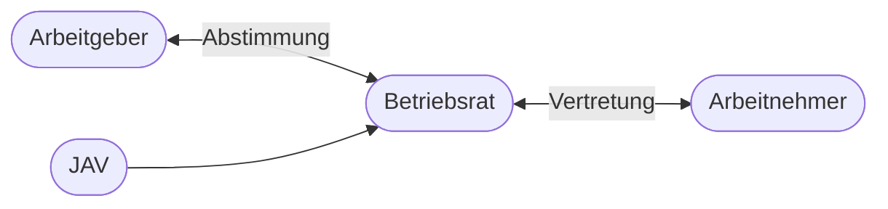

# Kapitel 6 – Mitbestimmungsrecht

  

  

  

  

  

  

  

  

  

  

<h3>Was du in diesem Kapitel lernst</h3>

- Was Mitbestimmungsrecht bedeutet und welche Gesetze es regeln
- Welche Rolle Betriebsrat und Jugend- und Auszubildendenvertretung (JAV) haben
- Wie du im Praktikum deine Beteiligungs- und Mitbestimmungsmöglichkeiten erkundest

---

## So gehst du vor

1. Lies die Kapitelinhalte und unterscheide Beteiligungs- und Mitbestimmungsrechte.
2. Bearbeite die **Kurzübungen** der Reihe nach – von Grundlagen bis Experte.
3. Arbeite die **Workshop-Aufgabe** durch. Sie vertieft das Gelernte an einem zusammenhängenden Szenario.

---

## 6.1 Grundlagen des Mitbestimmungsrechts

**Mitbestimmung** bedeutet: Arbeitnehmer haben über den Betriebsrat **Mitwirkungs- oder Mitbestimmungsrechte** bei bestimmten betrieblichen Entscheidungen. Ziel ist die **Ausgewogenheit** zwischen Arbeitgeberinteressen und Arbeitnehmerinteressen.

**Zentrale Gesetze:**

| Gesetz | Inhalt |
|---|---|
| Betriebsverfassungsgesetz (BetrVG) | Betriebsrat, Mitbestimmung, Beteiligung |
| Arbeitnehmerüberlassungsgesetz | Zeitarbeit |
| Montan-Mitbestimmungsgesetz | Besonders in Bergbau und Stahl |

---

## 6.2 Betriebsrat – Aufgaben und Rechte

Der **Betriebsrat** wird von den **Arbeitnehmern** des Betriebs gewählt. Er vertritt ihre Interessen gegenüber dem Arbeitgeber.

**Aufgaben (Auswahl):**

- Überwachung von Gesetzen, Tarifverträgen und Betriebsvereinbarungen
- Beteiligung bei Kündigungen, Versetzungen, Einstellungen
- Mitbestimmung bei sozialen Angelegenheiten (Arbeitszeit, Urlaub, Verhaltensregeln)
- Förderung der Berufsausbildung im Betrieb

**Arten der Beteiligung:**

| Art | Bedeutung | Beispiel |
|---|---|---|
| Informationsrecht | Arbeitgeber muss informieren | Wirtschaftliche Lage |
| Beratungsrecht | Betriebsrat wird angehört | Personalplanung |
| Mitbestimmungsrecht | Zustimmung erforderlich | Arbeitszeitregelungen in Betriebsvereinbarung |
| Mitwirkungsrecht | Betriebsrat kann Vorschläge machen | Ausbildungsförderung |

---

## 6.3 Jugend- und Auszubildendenvertretung (JAV)

In Betrieben mit einem Betriebsrat und **mindestens 5 jugendlichen oder auszubildenden Beschäftigten** (unter 18 Jahren bzw. Azubis unter 25) kann eine **Jugend- und Auszubildendenvertretung (JAV)** gewählt werden (§ 60 BetrVG).

| Thema | Rolle der JAV |
|---|---|
| Interessenvertretung | Anliegen junger und auszubildender Beschäftigter |
| Ausbildungsqualität | Einfluss auf betriebliche Ausbildung |
| Ansprechpartner | Für Azubis bei Problemen mit Ausbildung oder Betrieb |
| Betriebsrat | JAV arbeitet mit Betriebsrat zusammen |

!!! tip "JAV nutzen"
    Im Praktikum: **JAV kennenlernen**, an Sprechstunden gehen, bei Ausbildungsfragen nachfragen. Die JAV ist dein direkter Ansprechpartner für Azubi-Themen.

---

## 6.4 Mitbestimmung im IT-Betrieb

Typische Themen mit Beteiligung des Betriebsrats:

| Thema | Relevanz für IT |
|---|---|
| Arbeitszeit | Gleitzeit, On-Call, Schichtbetrieb im Rechenzentrum |
| Homeoffice | Regelungen, Ausstattung, Erreichbarkeit |
| Einführung von Software | z. B. Zeiterfassung, Monitoring – Mitbestimmung bei personalbezogenen Systemen |
| Weiterbildung | Betriebliche Qualifizierungsmaßnahmen |
| Kündigungsschutz | Bei Kündigung Auszubildender Betriebsrat beteiligt |

---

## 6.5 Erkundung im Praktikum

**Checkliste für dein Praktikum:**

1. Gibt es einen **Betriebsrat**? Wie erreichbar?
2. Gibt es eine **JAV**? Wer sind die Vertreter?
3. Welche **Betriebsvereinbarungen** gibt es (Arbeitszeit, Homeoffice, IT-Nutzung)?
4. Wie werden **Azubis** in betriebliche Entscheidungen einbezogen?
5. Gibt es regelmäßige **Azubi-Runden** oder Feedback mit Ausbildern?

---

## Kurzübungen

{{ task(file="tasks/tag6_01.yaml") }}

{{ task(file="tasks/tag6_02.yaml") }}

{{ task(file="tasks/tag6_03.yaml") }}

---

## Workshop

{{ task(file="tasks/workshop_k6.yaml") }}
