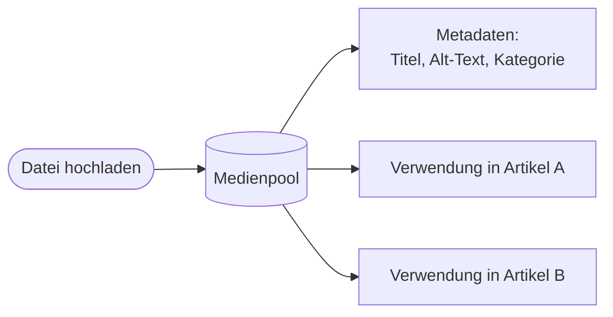
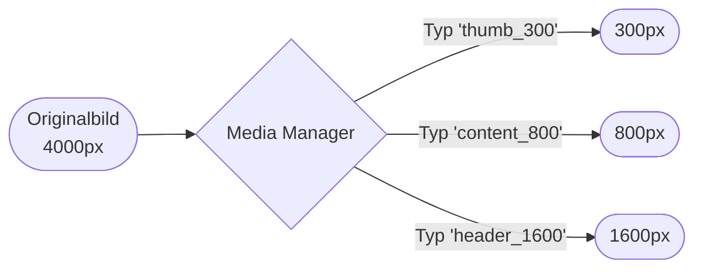
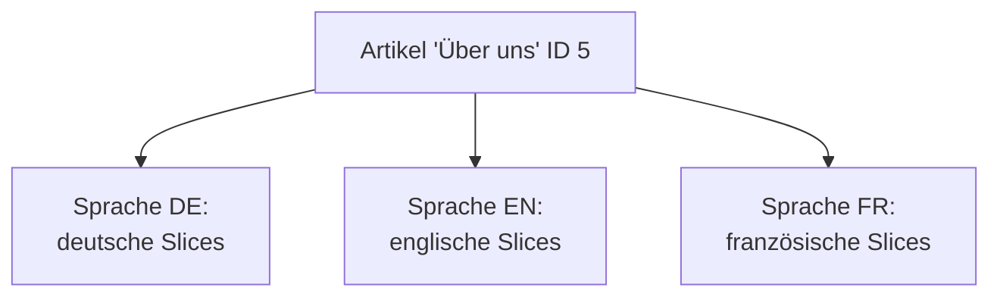

# Kapitel 6 – Content, Medien & Mehrsprachigkeit

<div class="kurs-progress">
  <div class="step done"></div>
  <div class="step done"></div>
  <div class="step done"></div>
  <div class="step done"></div>
  <div class="step done"></div>
  <div class="step active"></div>
  <div class="step"></div>
  <div class="step"></div>
  <div class="step"></div>
  <div class="step"></div>
</div>

<div class="lernziele" markdown>
<h3>Was du in diesem Kapitel lernst</h3>

- Wie du **Content** (Seiten/Beiträge) strukturiert erstellst und überarbeitest
- Wie der **Medienpool** funktioniert und wie du Bilder & Dateien sauber verwaltest
- Wie der **Media Manager** Bilder automatisch skaliert (Basis für Responsive Images)
- Wie **Mehrsprachigkeit** in REDAXO über **Sprachen (clang)** und das **Sprog**-AddOn funktioniert
- Was **Responsive Design** ist und wie du es bei der Content-Pflege berücksichtigst
</div>

---

## 6.1 Content erstellen und überarbeiten

Guter Content ist mehr als „Text eingeben". Er ist **strukturiert**, **auffindbar** und **wartbar**. In REDAXO entsteht Content durch **Slices** in **Artikeln** (Kapitel 5). Beim Erstellen und Überarbeiten helfen ein paar Grundregeln:

| Prinzip | Bedeutung |
|---|---|
| **Struktur vor Gestaltung** | Erst sinnvolle Überschriften-Hierarchie (H1 → H2 → H3), dann Feinschliff |
| **Ein H1 pro Seite** | Die Hauptüberschrift; darunter H2/H3 für Abschnitte |
| **Kurze Absätze** | Bessere Lesbarkeit, besonders mobil |
| **Sprechende Links** | „Zur Anmeldung" statt „hier klicken" |
| **Alternativtexte** | Jedes inhaltliche Bild braucht einen `alt`-Text (Barrierefreiheit & SEO) |

!!! info "Semantik zählt"
    Überschriften sind **keine** Gestaltungsmittel („groß und fett"), sondern **Struktur**. Suchmaschinen und Screenreader nutzen die Hierarchie. Deshalb gibt man die Ebene über das **Modul** vor (H2/H3), nicht über manuelles Vergrößern.

**Überarbeiten** heißt: bestehende Slices anpassen, Reihenfolge ändern, veraltete Inhalte offline nehmen. Nutze dafür die **Arbeitsversion** (Kapitel 5), damit die Live-Seite währenddessen stabil bleibt.

---

## 6.2 Der Medienpool

Der **Medienpool** ist die zentrale Dateiverwaltung von REDAXO. Statt Bilder lose in Artikel zu laden, liegen alle Dateien **an einem Ort** und können **mehrfach** verwendet werden.



| Funktion | Nutzen |
|---|---|
| **Medienkategorien** | Ordnerstruktur für Bilder/Dokumente (z. B. „Team", „Produkte") |
| **Metadaten (MetaInfo)** | Titel, Copyright, Alt-Text pro Datei pflegen |
| **Wiederverwendung** | Ein Bild einmal hochladen, überall referenzieren |
| **Rechtevergabe** | Rollen dürfen nur bestimmte Medienkategorien (Kapitel 4) |

!!! tip "Dateien sinnvoll benennen und sortieren"
    Lade Dateien mit **sprechenden Namen** hoch (`team-anna-mueller.jpg` statt `IMG_2931.jpg`) und sortiere sie in **Medienkategorien**. In großen Projekten spart das enorm Zeit und verhindert Dubletten.

!!! warning "Urheberrecht beachten"
    Verwende nur Bilder, für die du die **Nutzungsrechte** hast (eigene, lizenzierte oder freie Werke mit passender Lizenz). Halte die **Quelle/Lizenz** in den Metadaten fest. Bildrechteverstöße sind ein häufiger und teurer Fehler.

---

## 6.3 Der Media Manager – Bilder automatisch aufbereiten

Der **Media Manager** (Kern-AddOn) verarbeitet Bilder **on the fly**: Du definierst **Medientypen** (Effekt-Ketten) wie „Vorschau 300px" oder „Header 1600px", und der Media Manager erzeugt die passende Variante automatisch und cached sie.



Im Frontend rufst du eine Variante über die URL auf:

```
/media/thumb_300/team-anna-mueller.jpg
```

| Vorteil | Bedeutung |
|---|---|
| **Performance** | Der Browser lädt nur die benötigte Größe, nicht das 4000px-Original |
| **Konsistenz** | Alle Vorschaubilder haben dieselbe Größe/Qualität |
| **Wartbarkeit** | Größe zentral im Medientyp ändern, statt jedes Bild neu hochzuladen |

!!! info "Grundlage für Responsive Images"
    Weil der Media Manager mehrere Größen erzeugt, kannst du im HTML `srcset` nutzen (Abschnitt 6.6) und dem Browser passende Varianten anbieten. So verbindet sich **Medienverwaltung** mit **Responsive Design**.

---

## 6.4 Mehrsprachigkeit: Sprachen (clang)

REDAXO unterstützt Mehrsprachigkeit **ab Werk** über **Sprachen** (intern „clang" = *content language*). Unter **System → Sprachen** legst du zusätzliche Sprachen an (z. B. Deutsch, Englisch, Französisch).

**Wie es funktioniert:**

- Jeder **Artikel** existiert in **jeder Sprache** – mit **eigenen Inhalten** (Slices) pro Sprache.
- Die **Struktur** (Kategoriebaum) ist für alle Sprachen gleich, die **Inhalte** werden je Sprache gepflegt.
- Redakteure wechseln im Backend die Sprache und übersetzen die Slices.



!!! info "Rechte pro Sprache"
    Über die **Rollen** (Kapitel 4) kannst du festlegen, **welche Sprachen** ein Benutzer bearbeiten darf – z. B. eine Rolle „Redaktion EN" nur für die englische Version.

---

## 6.5 Sprog und YRewrite für mehrsprachige Sites

Zwei AddOns ergänzen die Mehrsprachigkeit:

| AddOn | Aufgabe |
|---|---|
| **Sprog** | Verwaltet **Textbausteine/Platzhalter**, die in Templates/Modulen fest verdrahtet sind (z. B. Button-Beschriftungen „Mehr lesen"/„Read more"). Über `wildcards` werden sie je Sprache ersetzt. Hilft auch beim **Synchronisieren** von Inhalten zwischen Sprachversionen. |
| **YRewrite** | Erzeugt **sprechende URLs** und kann **Domains/Pfade je Sprache** zuweisen (z. B. `example.com/de/` und `example.com/en/`), inkl. `hreflang`, `sitemap.xml` und `robots.txt`. |

!!! tip "Feste Texte gehören in Sprog, nicht ins Template"
    Übersetzbare Beschriftungen im Template schreibt man als **Sprog-Wildcard** (z. B. `+++more+++`), nicht direkt als „Mehr lesen". So bleibt das Template **sprachneutral** und Übersetzer pflegen nur die Sprog-Liste – wieder das Prinzip **Trennung von Inhalt und Darstellung**.

---

## 6.6 Responsive Design berücksichtigen

**Responsive Design** bedeutet: Die Website passt sich an **verschiedene Bildschirmgrößen** an (Smartphone, Tablet, Desktop). Das ist heute Pflicht – ein Großteil der Zugriffe kommt mobil.

Die drei technischen Bausteine:

1. **Viewport-Meta-Tag** im Template (hast du in Kapitel 5 gesehen):

```html
<meta name="viewport" content="width=device-width, initial-scale=1">
```

2. **Flexibles CSS** mit **Media Queries** (Details in Kapitel 7):

```css
.spalten { display: grid; grid-template-columns: 1fr; }

@media (min-width: 768px) {
    .spalten { grid-template-columns: 1fr 1fr; }  /* ab Tablet zweispaltig */
}
```

3. **Responsive Bilder** mit `srcset` (dank Media Manager, Abschnitt 6.3):

```html

```

| Als Redakteur berücksichtigen | Warum |
|---|---|
| **Mobile Vorschau** prüfen | Zeilenumbrüche/Bilder wirken mobil anders |
| Nicht zu lange Überschriften | Brechen auf kleinen Displays unschön um |
| Bilder im **richtigen Seitenverhältnis** | Verhindert Verzerrungen und Layout-Sprünge |
| Tabellen sparsam einsetzen | Sind mobil schwer darstellbar |

!!! info "Verantwortung teilt sich"
    Das **responsive Verhalten** legen Entwickler im **Template/CSS** an (Kapitel 7). Redakteure müssen es **berücksichtigen**: passende Bildgrößen wählen, mobil gegenprüfen, Inhalte nicht „für Desktop optimieren". Beide Seiten arbeiten zusammen.

---

## Kurzübungen

{{ task(file="tasks/kapitel6_01.yaml") }}

{{ task(file="tasks/kapitel6_02.yaml") }}

{{ task(file="tasks/kapitel6_03.yaml") }}

---

## Workshop

{{ task(file="tasks/workshop_k6.yaml") }}
