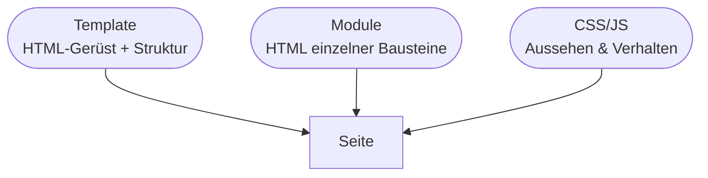
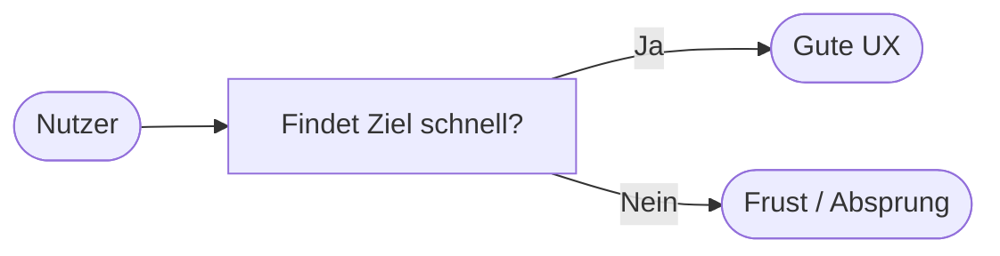
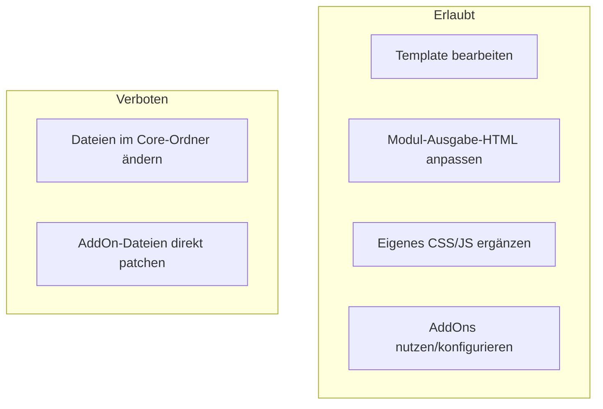

# Kapitel 7 – Layout & Design

<div class="kurs-progress">
  <div class="step done"></div>
  <div class="step done"></div>
  <div class="step done"></div>
  <div class="step done"></div>
  <div class="step done"></div>
  <div class="step done"></div>
  <div class="step active"></div>
  <div class="step"></div>
  <div class="step"></div>
  <div class="step"></div>
</div>

<div class="lernziele" markdown>
<h3>Was du in diesem Kapitel lernst</h3>

- Wie in REDAXO **Layout** über **Templates** und **Module** entsteht
- Wie du **CSS-Anpassungen** sauber einbindest und strukturierst
- Grundlagen der **UX** (User Experience): Lesbarkeit, Kontrast, Navigation, Konsistenz
- Wie du **HTML an einzelnen Komponenten** (Modulen) anpasst – **ohne Core-Hacks**
- Wie das **AssetPack**/Asset-Handling und der `theme`-Ordner das Design organisieren
</div>

---

## 7.1 Wo das Design in REDAXO „wohnt"

Anders als bei WordPress gibt es in REDAXO **kein fertiges Theme**, das man installiert. Du baust das Design **selbst** aus drei Bausteinen:



| Baustein | Zuständig für |
|---|---|
| **Template** | Grundgerüst: Kopf, Navigation, Inhaltsbereich, Fuß (Kapitel 5) |
| **Modul-Ausgabe** | HTML der einzelnen Inhaltsblöcke (Slices) |
| **CSS** | Farben, Abstände, Typografie, Responsive-Verhalten |
| **JavaScript** | Interaktion (Menü aufklappen, Slider …) – sparsam einsetzen |

!!! info "Volle Kontrolle = volle Verantwortung"
    Weil REDAXO nichts vorgibt, bestimmst du **jedes** HTML-Element selbst. Das ist ideal zum Lernen sauberer, semantischer Frontend-Entwicklung – erfordert aber Disziplin bei Struktur und Wartbarkeit.

---

## 7.2 CSS sauber einbinden

CSS- und JS-Dateien legst du typischerweise in einen **`assets/`**- oder **`theme/`**-Ordner deines Projekts und bindest sie im **Template** ein:

```html
<head>
    <meta charset="utf-8">
    <meta name="viewport" content="width=device-width, initial-scale=1">
    <title>REX_ARTICLE_NAME</title>

    <link rel="stylesheet" href="/assets/css/style.css">
</head>
<body>
    <!-- ... -->
    <script src="/assets/js/main.js" defer></script>
</body>
```

**Struktur einer wartbaren CSS-Datei:**

```css
/* 1. Design-Tokens als CSS-Variablen zentral definieren */
:root {
    --farbe-primaer: #0a5;
    --farbe-text:    #222;
    --abstand:       1rem;
    --font:          system-ui, sans-serif;
}

/* 2. Basis-Stile */
body { font-family: var(--font); color: var(--farbe-text); line-height: 1.6; }

/* 3. Komponenten (passend zu den Modulen) */
.textblock { margin-block: calc(var(--abstand) * 2); }
.button    { background: var(--farbe-primaer); color: #fff; padding: .6em 1.2em; }
```

| Prinzip | Nutzen |
|---|---|
| **CSS-Variablen** für Farben/Abstände | Design an **einer** Stelle ändern |
| **Komponenten-Klassen** passend zu Modulen | CSS und Module bleiben synchron |
| **Mobile-first** (Basis klein, `@media` für größer) | Sauberes Responsive-Verhalten (Kapitel 6) |
| **Keine `!important`-Flut** | Bleibt nachvollziehbar und überschreibbar |

!!! tip "Assets versionieren"
    Lege CSS/JS in die **Versionsverwaltung (Git)** und nicht in die Datenbank. So kannst du Design-Änderungen nachvollziehen und im Team zusammenarbeiten. Das **AssetPack**-AddOn hilft beim Bündeln/Minifizieren für die Live-Umgebung.

---

## 7.3 UX-Grundsätze

**UX (User Experience)** ist die Qualität des Nutzungserlebnisses. Gutes Design ist nicht „hübsch", sondern **verständlich und bedienbar**. Wichtige Grundsätze:

| Grundsatz | Bedeutung |
|---|---|
| **Lesbarkeit** | Ausreichende Schriftgröße (mind. ~16px Body), Zeilenlänge ~60–80 Zeichen, genug Zeilenabstand |
| **Kontrast** | Text/Hintergrund mit ausreichendem Kontrast (WCAG-Richtwert 4.5:1) |
| **Konsistenz** | Gleiche Elemente sehen gleich aus und verhalten sich gleich |
| **Klare Navigation** | Nutzer wissen immer, wo sie sind und wie sie weiterkommen |
| **Sichtbares Feedback** | Buttons/Links reagieren erkennbar (Hover, Fokus) |
| **Barrierefreiheit** | Tastatur-Bedienbarkeit, Alt-Texte, Fokus-Stile, semantisches HTML |



!!! warning "Barrierefreiheit ist Pflicht, nicht Kür"
    Für viele öffentliche und gewerbliche Websites gelten **gesetzliche Barrierefreiheits-Anforderungen** (z. B. BFSG/EN 301 549). Semantisches HTML, Kontraste, Alt-Texte und Tastaturbedienung sind daher kein „Nice-to-have". Ein Screenreader liest deine **Überschriften-Struktur** (Kapitel 6) – ein weiterer Grund, sie sauber zu halten.

---

## 7.4 HTML an Komponenten anpassen – ohne Core-Hacks

In Kapitel 1 hast du die Regel kennengelernt: **niemals den Core ändern**. Beim Design bedeutet das konkret:



**Anpassung an einer Komponente – Beispiel:** Du willst, dass das Modul „Bild mit Text" das Bild rechts statt links anzeigt. Du änderst **nicht** den Core, sondern die **Ausgabe des Moduls** und ergänzt CSS:

*Modul-Ausgabe (angepasst):*

```html
<section class="bild-text bild-text--rechts">
    <div class="bild-text__media">REX_MEDIA[id=1]</div>
    <div class="bild-text__inhalt">REX_VALUE[1]</div>
</section>
```

*Ergänzendes CSS:*

```css
.bild-text { display: grid; gap: 1rem; grid-template-columns: 1fr; }

@media (min-width: 768px) {
    .bild-text { grid-template-columns: 1fr 1fr; }
    .bild-text--rechts .bild-text__media { order: 2; }  /* Bild nach rechts */
}
```

!!! warning "Warum keine Core-Hacks?"
    Änderst du Core- oder AddOn-Dateien direkt, gehen deine Anpassungen beim **nächsten Update** verloren (Kapitel 8) – oder das Update schlägt fehl. Anpassungen gehören immer in **Template, Module, eigenes CSS/JS** oder in ein **eigenes Projekt-AddOn**. Für kleine Erweiterungen gibt es das mitgelieferte **`project`-AddOn** als sicheren Ort für eigenen Code.

!!! tip "Developer-AddOn für Design-Arbeit"
    Das **Developer**-AddOn synchronisiert Templates, Module und Aktionen zwischen **Datenbank und Dateisystem**. Dadurch kannst du HTML/PHP der Module in deinem Code-Editor bearbeiten und in Git versionieren – viel angenehmer als das Backend-Textfeld.

---

## Kurzübungen

{{ task(file="tasks/kapitel7_01.yaml") }}

{{ task(file="tasks/kapitel7_02.yaml") }}

{{ task(file="tasks/kapitel7_03.yaml") }}

---

## Workshop

{{ task(file="tasks/workshop_k7.yaml") }}
