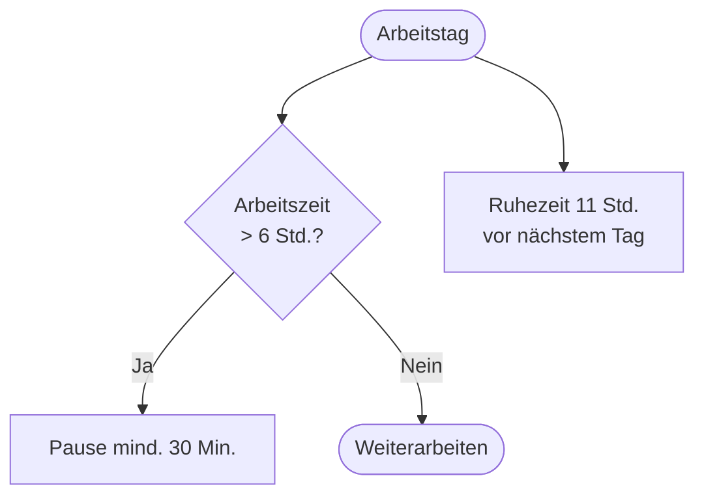

# Kapitel 7 – Tarifrecht und Arbeitszeit

  

  

  

  

  

  

  

  

  

  

<h3>Was du in diesem Kapitel lernst</h3>

- Was ein Tarifvertrag ist und wie er Arbeitsverhältnisse beeinflusst
- Welche Regelungen das Arbeitszeitgesetz (ArbZG) vorsieht
- Wie Überstunden, Gleitzeit und tarifliche Sonderregelungen zusammenwirken

---

## So gehst du vor

1. Lies die Kapitelinhalte und unterscheide gesetzliche und tarifliche Regelungen.
2. Bearbeite die **Kurzübungen** der Reihe nach – von Grundlagen bis Experte.
3. Arbeite die **Workshop-Aufgabe** durch. Sie vertieft das Gelernte an einem zusammenhängenden Szenario.

---

## 7.1 Tarifvertrag – Grundlagen

Ein **Tarifvertrag** ist eine Vereinbarung zwischen **Arbeitgeberverbänden** (oder einzelnen Arbeitgebern) und **Gewerkschaften**. Er gilt für die **tarifgebundenen** Arbeitnehmer eines Betriebs oder einer Branche.

**Typische Inhalte:**

| Inhalt | Beispiel |
|---|---|
| Entgelt | Gehaltsstufen, Ausbildungsvergütung über BBiG-Minimum |
| Arbeitszeit | Wochenarbeitszeit, Gleitzeit, Schichtmodelle |
| Urlaub | Urlaubstage über gesetzliches Minimum |
| Zusatzleistungen | Weihnachtsgeld, VWL, betriebliche Altersvorsorge |
| Kündigungsfristen | Oft länger als gesetzlich |

**Geltungsbereich:**

- **Allgemeinverbindlich** erklärte Tarifverträge gelten für alle Betriebe der Branche
- Im Betrieb: Tarifbindung durch **Tarifvertrag**, **Betriebsvereinbarung** oder **Einzelvertrag** mit Verweis auf Tarif

!!! info "IT-Branche"
    In der IT gibt es verschiedene Tariflandschaften – öffentlicher Dienst (TVöD/TV-L), Metall/Elektro (IG Metall), oder **ohne Tarif** in vielen IT-Dienstleistungsbetrieben. Dann gilt individueller Vertrag + Gesetze.

---

## 7.2 Arbeitszeitgesetz (ArbZG)

Das **Arbeitszeitgesetz** schützt die **Gesundheit** der Arbeitnehmer durch Höchstarbeitszeiten und Pausenregelungen.

| Regelung | Inhalt (vereinfacht) |
|---|---|
| Tägliche Arbeitszeit | Max. 8 Stunden, in Ausnahmen 10 Stunden |
| Wochenarbeitszeit | In der Regel max. 48 Stunden inkl. Überstunden (6 Monate Durchschnitt) |
| Ruhezeit | Mindestens 11 Stunden zwischen Arbeitstagen |
| Pausen | Ab 6 Std.: 30 Min., ab 9 Std.: 45 Min. Pause |
| Sonn- und Feiertagsarbeit | Grundsätzlich verboten, Ausnahmen geregelt |
| Nachtarbeit | Besondere Schutzvorschriften (22–6 Uhr) |

---

## 7.3 Überstunden und Gleitzeit

| Begriff | Erklärung |
|---|---|
| Überstunden | Arbeitszeit über die vertraglich vereinbarte Zeit |
| Mehrarbeit | Über die tariflich/gesetzlich geregelte Höchstarbeitszeit |
| Gleitzeit | Flexible Beginn-/Endzeiten innerhalb eines Rahmens |
| Kernarbeitszeit | Zeit, in der Anwesenheit verpflichtend ist |

**Vergütung Überstunden:**

- Tarifvertrag oder Arbeitsvertrag regelt: Auszahlung oder Freizeitausgleich
- Ohne Regelung: oft Anspruch auf Vergütung (BGB)

!!! warning "Auszubildende"
    Auszubildende dürfen **nicht** wie Vollzeitkräfte belastet werden. Jugendarbeitsschutz und BBiG begrenzen Belastung. Überstunden nur in engen Grenzen und mit Zustimmung.

---

## 7.4 Arbeitszeit in der IT

| Szenario | Typische Regelung |
|---|---|
| Entwicklung mit Deadlines | Gleitzeit, gelegentliche Überstunden – tariflich geregelt |
| Support / On-Call | Bereitschaftsdienst, Zuschläge im Tarif |
| Rechenzentrum | Schichtarbeit, Nachtzuschläge |
| Homeoffice | Arbeitszeiterfassung seit Rechtsprechung/ Gesetz wichtiger |

---

## Kurzübungen

{{ task(file="tasks/tag7_01.yaml") }}

{{ task(file="tasks/tag7_02.yaml") }}

{{ task(file="tasks/tag7_03.yaml") }}

---

## Workshop

{{ task(file="tasks/workshop_k7.yaml") }}
