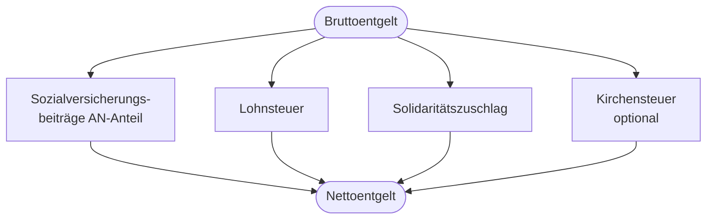

# Kapitel 8 – Entgeltabrechnung

  

  

  

  

  

  

  

  

  

  

<h3>Was du in diesem Kapitel lernst</h3>

- Wie eine Entgeltabrechnung aufgebaut ist und welche Positionen sie enthält
- Was Brutto und Netto bedeuten und welche Abzüge typisch sind
- Welche rechtlichen und wirtschaftlichen Zusammenhänge ein Beschäftigungsverhältnis hat – in Unterrichts- und Praktikumsphase

---

## So gehst du vor

1. Lies die Kapitelinhalte und studiere das Beispiel einer Abrechnung.
2. Bearbeite die **Kurzübungen** der Reihe nach – von Grundlagen bis Experte.
3. Arbeite die **Workshop-Aufgabe** durch. Sie vertieft das Gelernte an einem zusammenhängenden Szenario.

---

## 8.1 Aufbau der Entgeltabrechnung

Die **Entgeltabrechnung** (Lohn- oder Gehaltsabrechnung) zeigt, wie sich das **Nettoentgelt** aus dem **Bruttoentgelt** ergibt. Arbeitgeber müssen monatlich eine Abrechnung erstellen.

---

## 8.2 Typische Positionen auf der Abrechnung

| Position | Erklärung |
|---|---|
| Bruttoentgelt / Grundvergütung | Ausbildungsvergütung oder Gehalt vor Abzügen |
| Zuschläge / Zulagen | z. B. Nachtarbeit, Weihnachtsgeld (brutto) |
| KV, PV, RV, AV | Arbeitnehmeranteil Sozialversicherung |
| Lohnsteuer | Einkommensteuer-Vorauszahlung |
| Solidaritätszuschlag | 5,5 % auf Lohnsteuer (mit Freigrenzen) |
| Kirchensteuer | Falls Kirchensteuerpflicht |
| Nettoentgelt | Auszahlungsbetrag |
| Arbeitgeberanteile | Nicht vom Netto abgezogen, aber auf Abrechnung sichtbar |

---

## 8.3 Ausbildungsvergütung

Seit der Reform des BBiG gibt es eine **gesetzliche Mindestausbildungsvergütung** (staffelt nach Ausbildungsjahr). Tarifverträge können höhere Beträge vorsehen.

| Ausbildungsjahr | Mindestvergütung (Stand: prüfe aktuelle BBiG-Werte) |
|---|---|
| 1. Jahr | Gesetzlicher Mindestbetrag |
| 2. Jahr | höherer Mindestbetrag |
| 3. Jahr | höherer Mindestbetrag |
| 4. Jahr (falls) | höherer Mindestbetrag |

!!! info "Aktuelle Beträge prüfen"
    Die **Mindestausbildungsvergütung** wird regelmäßig angepasst. Für Prüfungen und deine Planung: aktuelle Werte auf der Website des BMBF oder der IHK nachschlagen.

---

## 8.4 Lohnsteuer und Steuerklassen

| Steuerklasse | Typische Situation |
|---|---|
| I | Ledig, keine Kinder |
| II | Alleinerziehend |
| III / V | Ehepaare (Hauptverdiener / Geringverdiener) |
| IV | Ehepaare mit ähnlichem Einkommen |
| VI | Nebenjob, zweiter Job |

**Lohnsteuerabzug** hängt von Steuerklasse, Freibeträgen und Sozialversicherungsbeiträgen ab. Auszubildende mit niedriger Vergütung zahlen oft **wenig oder keine** Lohnsteuer.

---

## 8.5 Entgeltabrechnung: Azubi vs. Umschüler

Eine **Entgeltabrechnung** bekommst du nur aus einem **Beschäftigungsverhältnis**. Das trifft auf den **regulären Azubi** zu – nicht auf das unbezahlte Umschüler-Praktikum.

| Konstellation | Einkommen | Abrechnung |
|---|---|---|
| Regulärer Azubi (Ausbildungsvertrag) | Ausbildungsvergütung | Monatliche Entgeltabrechnung mit SV und Steuer |
| Umschüler (Unterricht + unbezahltes Praktikum) | ALG I / Bürgergeld / Übergangsgeld – je nach Fall | Keine Lohn-/Entgeltabrechnung; stattdessen Bescheide der Agentur |

**Wirtschaftliche Zusammenhänge verstehen:**

- Brutto ≠ verfügbares Geld
- Sozialversicherung = Absicherung für Krankheit, Alter, Arbeitslosigkeit
- Netto reicht für Miete, Versicherung, Lebenshaltung? → **Haushaltsplanung**

---

## 8.6 Beispiel (vereinfacht)

| Position | Betrag |
|---|---|
| Brutto Ausbildungsvergütung | 1.000,00 € |
| − KV AN | − 75,00 € |
| − PV AN | − 18,00 € |
| − RV AN | − 93,00 € |
| − AV AN | − 13,00 € |
| − Lohnsteuer | − 0,00 € |
| **Netto** | **801,00 €** |

(Werte illustrativ – individuelle Abrechnung kann abweichen.)

---

## Kurzübungen

{{ task(file="tasks/tag8_01.yaml") }}

{{ task(file="tasks/tag8_02.yaml") }}

{{ task(file="tasks/tag8_03.yaml") }}

---

## Workshop

{{ task(file="tasks/workshop_k8.yaml") }}
