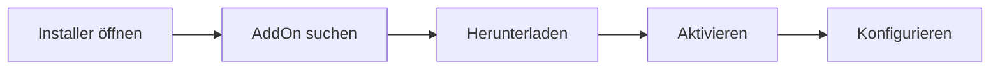
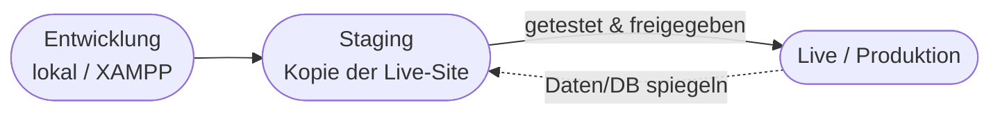
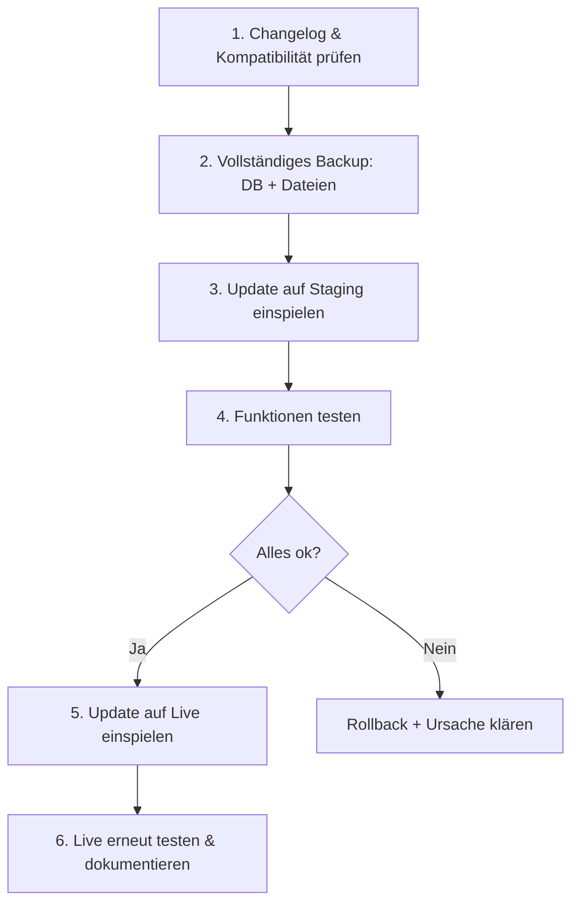
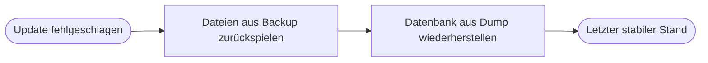

# Kapitel 8 – AddOns, Updates & Staging

  

  

  

  

  

  

  

  

  

  

<h3>Was du in diesem Kapitel lernst</h3>

- Was **AddOns** sind und wie du sie über den **Installer** installierst
- Wie du AddOns **prüfst**: Kompatibilität, Herkunft und Changelog
- Warum eine **Staging-Umgebung** wichtig ist und wie ein Update-Prozess abläuft
- Wie du **Updates und Upgrades** planst und den Unterschied verstehst
- Wie du im Fehlerfall einen **Rollback** durchführst

---

## 8.1 AddOns – Erweiterungen für REDAXO

Der REDAXO-Kern ist bewusst schlank. Zusatzfunktionen kommen über **AddOns** dazu (Kapitel 1: bei anderen CMS „Plugin/Extension/Module"). Wichtige AddOns aus dem REDAXO-Ökosystem:

| AddOn | Funktion |
|---|---|
| **YForm** | Formulare **und** eigene Datenbank-Tabellen verwalten (Kapitel 9) |
| **YRewrite** | Sprechende URLs, Multi-Domain, SEO, `sitemap.xml`/`robots.txt` (Kapitel 6) |
| **Media Manager** | Bilder skalieren/aufbereiten (Kern-AddOn, Kapitel 6) |
| **MetaInfo** | Zusätzliche Metafelder für Artikel/Medien/Kategorien |
| **Sprog** | Übersetzbare Textbausteine (Kapitel 6) |
| **consent_manager** | DSGVO-Cookie-Banner (Kapitel 9) |
| **Backup** | Datenbank sichern/wiederherstellen (Kapitel 3) |
| **Cronjob** | Zeitgesteuerte Aufgaben (z. B. automatische Backups) |
| **Developer** | Templates/Module ins Dateisystem synchronisieren (Kapitel 7) |

**Installation über den `Installer`:** Im Backend unter **AddOns → Installer** durchsuchst du das offizielle Verzeichnis, lädst ein AddOn herunter und aktivierst es. Alternativ lädst du das ZIP manuell in `redaxo/data/addons/` bzw. `redaxo/src/addons/` (je nach Typ) hoch.

!!! info "Herunterladen ≠ Aktivieren"
    In REDAXO ist ein AddOn erst **heruntergeladen** (Dateien liegen vor) und muss dann **aktiviert** werden (Tabellen anlegen, einbinden). Deaktivieren macht es inaktiv, ohne Daten zu löschen; **Deinstallieren** entfernt auch die Daten.

---

## 8.2 AddOns prüfen: Kompatibilität, Herkunft, Changelog

Nicht jedes AddOn ist gepflegt oder passt zu deiner REDAXO-Version. **Vor** der Installation prüfst du drei Dinge:

| Prüfpunkt | Frage | Wo nachsehen |
|---|---|---|
| **Kompatibilität** | Läuft das AddOn mit **meiner** REDAXO- und **PHP**-Version? | `package.yml` (`requires: redaxo: ^5.x`), AddOn-Seite |
| **Herkunft** | Kommt es aus einer **vertrauenswürdigen** Quelle? | redaxo.org-Verzeichnis, **FriendsOfREDAXO** (GitHub) |
| **Changelog** | Wird es **gepflegt**? Was hat sich zuletzt geändert? | `CHANGELOG.md`, GitHub-Releases, letzter Update-Zeitpunkt |

!!! warning "Fremde Quellen sind ein Sicherheitsrisiko"
    Ein AddOn führt **eigenen Code** mit den Rechten deines CMS aus. Installiere nur AddOns aus dem **offiziellen Verzeichnis** oder von bekannten Maintainern (z. B. **FriendsOfREDAXO**). Prüfe **Aktualität** (letztes Update), **offene Issues** und ob es zur Core-Version passt. Ein seit Jahren nicht aktualisiertes AddOn kann Sicherheitslücken enthalten.

!!! tip "Weniger ist mehr"
    Jedes AddOn vergrößert die **Angriffsfläche** und den **Pflegeaufwand**. Installiere nur, was du wirklich brauchst, und **entferne** ungenutzte AddOns. Das gilt genauso für Plugins in WordPress & Co.

---

## 8.3 Updates vs. Upgrades

| Begriff | Bedeutung | Beispiel |
|---|---|---|
| **Update** | Kleinere Aktualisierung innerhalb einer Hauptversion (Fehler-/Sicherheitsfixes) | REDAXO 5.20.1 → 5.20.2 |
| **Upgrade** | Sprung auf eine neue Hauptversion (größere Änderungen, evtl. Anpassungsbedarf) | REDAXO 5.x → 6.x |

- **Updates** sind meist unkritisch, sollten aber **zeitnah** eingespielt werden – besonders **Sicherheitsupdates**.
- **Upgrades** brauchen **Planung**: Changelog/Migrationshinweise lesen, AddOn-Kompatibilität prüfen, gründlich testen.

!!! info "Sicherheitsupdates zeitnah einspielen"
    Veraltete Software ist die **häufigste Einfallstür** für Angriffe. „Aktuell halten" ist eine der wichtigsten Schutzmaßnahmen (Kapitel 10) – für **Core und AddOns**.

---

## 8.4 Staging – nie direkt auf Live testen

Eine **Staging-Umgebung** ist eine **Kopie** der Live-Website, auf der man Änderungen und Updates **gefahrlos testet**, bevor sie live gehen.

| Umgebung | Zweck |
|---|---|
| **Entwicklung** | Neue Features bauen (lokal, Kapitel 2) |
| **Staging** | Updates/Änderungen unter realen Bedingungen testen |
| **Produktion (Live)** | Die öffentliche Website – hier wird **nicht** experimentiert |

!!! warning "Updates niemals ungetestet auf Live"
    Ein Update kann mit einem AddOn oder deinem Template kollidieren. Deshalb: **erst auf Staging** einspielen, testen, **dann** auf Live. Wer kein Staging hat, macht **mindestens** vorher ein vollständiges Backup und einen Test in einer lokalen Kopie.

---

## 8.5 Ein sicherer Update-Prozess

Der bewährte Ablauf für jedes Update – als wiederholbare Checkliste:

1. **Changelog & Kompatibilität** prüfen (Abschnitt 8.2).
2. **Backup** von **Datenbank + Dateien** erstellen (Kapitel 3) – die Grundlage für den Rollback.
3. Update auf **Staging** einspielen.
4. **Testen** (Frontend + Backend + betroffene AddOns).
5. Bei Erfolg auf **Live** einspielen.
6. Live **erneut testen** und die Änderung **dokumentieren**.

---

## 8.6 Rollback – zurück auf den letzten stabilen Stand

Ein **Rollback** ist die Rückkehr zum letzten funktionierenden Zustand, wenn ein Update fehlschlägt. Er funktioniert **nur**, wenn du **vorher** ein Backup gemacht hast.

**Rollback-Schritte:**

1. Betroffene **Dateien** aus dem Datei-Backup zurückkopieren.
2. **Datenbank** aus dem passenden `.sql`-Dump wiederherstellen (Kapitel 3).
3. **Cache leeren** und Funktion prüfen.
4. **Ursache** des Fehlers analysieren, bevor du das Update erneut versuchst.

!!! warning "DB und Dateien gehören zusammen"
    Spielst du nur die Dateien zurück, aber nicht die passende Datenbank (oder umgekehrt), entsteht ein **inkonsistenter** Zustand. Ein Rollback umfasst immer **beide** Teile aus **demselben** Backup-Zeitpunkt. Mehr zu Restore und Notfall in **Kapitel 10**.

---

## Kurzübungen

{{ task(file="tasks/kapitel8_01.yaml") }}

{{ task(file="tasks/kapitel8_02.yaml") }}

{{ task(file="tasks/kapitel8_03.yaml") }}

---

## Workshop

{{ task(file="tasks/workshop_k8.yaml") }}
