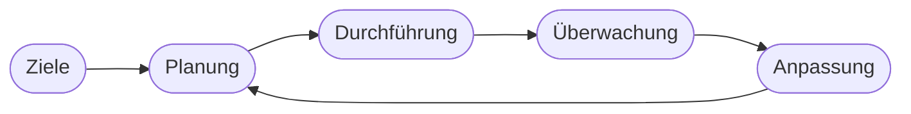

# Kapitel 9 – Lern- und Arbeitstechniken

  

  

  

  

  

  

  

  

  

  

<h3>Was du in diesem Kapitel lernst</h3>

- Welche modernen Lern- und Arbeitstechniken für die Umschulung geeignet sind
- Wie selbstgesteuertes Lernen im Online-Unterricht funktioniert
- Welche digitale Werkzeuge und Informationsquellen du beruflich sinnvoll nutzen kannst

---

## So gehst du vor

1. Lies die Kapitelinhalte und probiere mindestens eine neue Methode aus.
2. Bearbeite die **Kurzübungen** der Reihe nach – von Grundlagen bis Experte.
3. Arbeite die **Workshop-Aufgabe** durch. Sie vertieft das Gelernte an einem zusammenhängenden Szenario.

---

## 9.1 Selbstgesteuertes Lernen

In der **Umschulung** – besonders in der **Online-Unterrichtsphase** – trägst du die Hauptverantwortung für deinen Lernfortschritt. **Selbstgesteuertes Lernen** bedeutet:

| Element | Praxis |
|---|---|
| Zielsetzung | Was muss ich diese Woche / diesen Monat erreichen? |
| Planung | Lernzeiten blocken, Puffer einplanen |
| Durchführung | Material lesen, Übungen, Videos, Peer-Learning |
| Überwachung | Bin ich im Plan? Was fehlt noch? |
| Anpassung | Methode oder Tempo ändern, wenn nötig |

---

## 9.2 Lernmethoden für Fachinhalte und WISO

| Methode | Beschreibung | Geeignet für |
|---|---|---|
| Pomodoro | 25 Min. fokussiert, 5 Min. Pause | Konzentriertes Lesen, Übungen |
| Active Recall | Selbst abfragen statt nur lesen | Prüfungsvorbereitung |
| Cornell-Methode | Notizen mit Kernfragen-Spalte | WISO, Fachtheorie |
| Lerngruppen | Discord, Teams, Präsenz | Erklären, diskutieren, motivieren |
| Spaced Repetition | Wiederholung in Abständen | Vokabeln, Definitionen, Paragraphen |
| Praxisprojekte | Kleine IT-Projekte parallel | Programmierung, Netzwerk |

!!! tip "Online-Unterricht"
    Kamera an (wenn möglich), feste Lernzeiten, Ablenkungen minimieren. **Lernumgebung** wie Arbeitsplatz einrichten – nicht vom Sofa lernen.

---

## 9.3 Digitale Werkzeuge

| Kategorie | Beispiele | Nutzen |
|---|---|---|
| Lernplattform | Moodle, LMS des Trägers | Material, Abgaben, Tests |
| Notizen | Notion, Obsidian, OneNote | Strukturierte Wissensbasis |
| Kalender | Google Calendar, Outlook | Lern- und Prüfungsplanung |
| Code & IT | GitHub, VS Code, Docker | Fachpraxis, Portfolio |
| Kommunikation | Teams, Slack, Discord | Lerngruppe, Betrieb |
| Zeiterfassung | Toggl, simple Listen | Selbstreflexion Lernzeit |

---

## 9.4 Beruflich relevante Informationsquellen

| Quelle | Inhalt |
|---|---|
| IHK / HWK | Ausbildung, Prüfung, Verträge |
| BIBB | Ausbildungsordnungen, Berufsinfos |
| Gesetze im Internet (gesetze-im-internet.de) | BBiG, ArbZG, BetrVG |
| Stack Overflow, DevDocs | Technische Fragen |
| Heise, Golem, t3n | IT-News, Trends |
| Fachbücher / Open Textbooks | Tieferes Verständnis |

**Quellen kritisch prüfen:** Aktualität, Autorität, Zweck (Werbung vs. Information).

---

## 9.5 Arbeitstechniken im Betrieb

| Technik | Beschreibung |
|---|---|
| Ticket-Systeme | Jira, Redmine – Aufgaben strukturieren |
| Dokumentation | Confluence, Wikis – Wissen festhalten |
| Timeboxing | Feste Zeitfenster für Tasks |
| Priorisierung | MoSCoW, Eisenhower-Matrix |
| Berichtsheft digital | Apps oder Vorlagen der Kammer |

---

## Kurzübungen

{{ task(file="tasks/tag9_01.yaml") }}

{{ task(file="tasks/tag9_02.yaml") }}

{{ task(file="tasks/tag9_03.yaml") }}

---

## Workshop

{{ task(file="tasks/workshop_k9.yaml") }}
