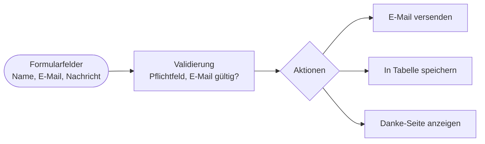
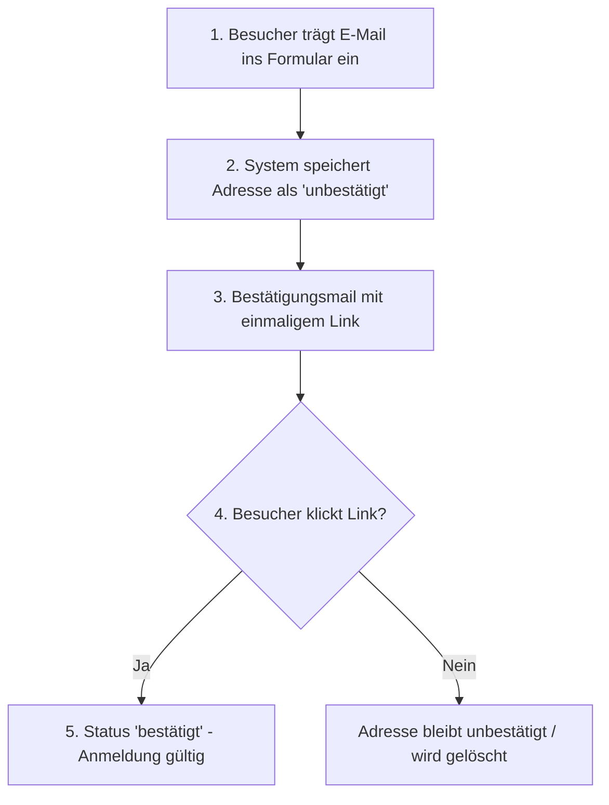
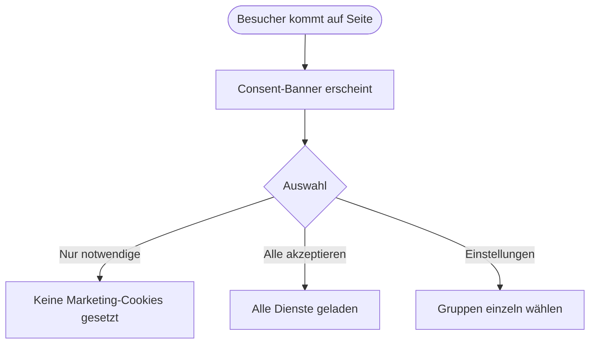

# Kapitel 9 – Mailing, Newsletter & Datenschutz

  

  

  

  

  

  

  

  

  

  

<h3>Was du in diesem Kapitel lernst</h3>

- Wie du mit **YForm** ein **Kontakt- oder Anmeldeformular** baust
- Wie REDAXO **E-Mails** versendet (PHPMailer) und was du beim Mailversand beachtest
- Was **Newsletter** und das **Double-Opt-in-Verfahren** sind und warum es Pflicht ist
- Wie du **Cookie-Hinweise** mit dem **consent_manager** DSGVO-konform umsetzt
- Welche **Datenschutz-Grundlagen** (DSGVO) im CMS-Kontext gelten

---

## 9.1 Formulare mit YForm

**YForm** ist das zentrale AddOn für Formulare und Datenverwaltung in REDAXO. Es kann zweierlei:

- **Formulare** im Frontend erzeugen und verarbeiten (Validierung, E-Mail-Versand, Speichern).
- Eigene **Datenbank-Tabellen** im Backend verwalten (Tabellen-Manager).

Ein Formular besteht aus **Feldern** (Value-Fields), **Validierungen** und **Aktionen**:

| Bestandteil | Beispiel |
|---|---|
| **Feld (value)** | `text`, `email`, `textarea`, `checkbox` |
| **Validierung** | `empty` (Pflichtfeld), `type` (E-Mail-Format), `customfunction` |
| **Aktion** | `action email` (Mail senden), `action db` (speichern), `showtext` |

!!! info "Pipe-Notation oder PHP"
    YForm-Formulare kannst du in der kompakten **Pipe-Notation** definieren oder in flexiblerer **PHP-Schreibweise**. Für einfache Kontaktformulare genügt die Pipe-Notation; für komplexe Logik nutzt man PHP.

!!! warning "Spam-Schutz einplanen"
    Öffentliche Formulare ziehen **Spam** an. Baue Schutz ein: ein **Honeypot-Feld** (unsichtbares Feld, das Bots ausfüllen), Zeitprüfung oder ein Captcha. Prüfe und **bereinige** außerdem alle Eingaben serverseitig (Validierung) – niemals ungeprüft weiterverarbeiten.

---

## 9.2 E-Mail-Versand mit PHPMailer

REDAXO versendet E-Mails über das Kern-AddOn **PHPMailer**. Dort konfigurierst du **wie** gesendet wird:

| Einstellung | Empfehlung |
|---|---|
| **Versandart** | **SMTP** (authentifiziert) statt der PHP-`mail()`-Funktion |
| **Absender** | Eine echte Adresse **deiner Domain** (nicht die Besucher-Adresse) |
| **Verschlüsselung** | TLS/SSL zum Mailserver |
| **Reply-To** | Hier die Adresse des Absenders (Formular-Ausfüllers) setzen |

!!! tip "Warum SMTP und eigene Absenderadresse?"
    Mails, die als Absender die **fremde** Besucheradresse tragen oder ohne Authentifizierung verschickt werden, landen oft im **Spam** oder werden vom Empfängerserver abgelehnt (SPF/DKIM/DMARC). Nutze eine **eigene, authentifizierte** Absenderadresse und trage die Besucheradresse als **Reply-To** ein.

---

## 9.3 Newsletter und Double-Opt-in

Ein **Newsletter** verschickt regelmäßig E-Mails an Abonnenten. Der rechtlich entscheidende Punkt ist die **Einwilligung**: Ohne Zustimmung darfst du **keine** Werbe-Mails verschicken.

Das vorgeschriebene Verfahren ist das **Double-Opt-in**:

| Schritt | Warum |
|---|---|
| **Opt-in** (Formular) | Aktive Anmeldung durch den Nutzer |
| **Bestätigungsmail** | Beweist, dass die Adresse dem Anmeldenden gehört |
| **Bestätigungsklick** | **Double**-Opt-in: schützt vor fremden Anmeldungen & ist rechtlich verlangt |
| **Abmeldung (Opt-out)** | In **jeder** Newsletter-Mail muss ein Abmeldelink stehen |

!!! warning "Double-Opt-in ist rechtlich Pflicht"
    Nach DSGVO/UWG brauchst du eine **nachweisbare Einwilligung**. Das **Double-Opt-in** liefert diesen Nachweis (Zeitpunkt, IP, Bestätigung). Ein **einfaches** Opt-in (ohne Bestätigungsklick) ist nicht ausreichend. Mit **YForm** setzt du das um: Adresse speichern → Status „unbestätigt" → Bestätigungsmail mit Token-Link → beim Klick Status auf „bestätigt".

!!! info "Werbe-Mails nur mit Einwilligung"
    Auch die **Anmeldung selbst** darf nicht mit anderen Zwecken „gekoppelt" werden (z. B. „nur mit Newsletter bestellbar"). Einwilligung muss **freiwillig, informiert und getrennt** erfolgen.

---

## 9.4 Cookie-Hinweise mit dem consent_manager

Sobald deine Website **nicht zwingend notwendige** Cookies oder externe Dienste (YouTube, Google Maps, Analytics) einsetzt, brauchst du eine **Einwilligung** – das klassische **Cookie-Banner**. In REDAXO ist der **consent_manager** (FriendsOfREDAXO) das Standard-AddOn dafür.

| Funktion | Nutzen |
|---|---|
| **Opt-in-Banner** | Besucher stimmt Diensten/Cookies **aktiv** zu |
| **Gruppen** | Dienste in Kategorien bündeln (z. B. „Notwendig", „Statistik", „Marketing") |
| **Gruppe „Notwendig"** | Kann **nicht** deaktiviert werden (technisch erforderlich) |
| **Nachträglich änderbar** | Auswahl später erneut aufrufbar (z. B. Link im Impressum) |
| **Inline-Consent** | Externe Embeds (YouTube etc.) erst nach Zustimmung laden |
| **Mehrsprachig / Multi-Domain** | Passt zu Kapitel 6 |

!!! warning "Erst Einwilligung, dann laden"
    Ein Banner allein genügt nicht: Nicht-notwendige Skripte/Cookies dürfen **erst nach** der Einwilligung geladen werden. Deshalb bindet man externe Dienste über den **Inline-Consent** des consent_manager ein – so wird z. B. ein YouTube-Video erst nach Zustimmung geladen. Ein Banner, das trackt „egal was der Nutzer klickt", ist **nicht** DSGVO-konform.

---

## 9.5 Datenschutz-Grundlagen im CMS

Die **DSGVO** (Datenschutz-Grundverordnung) regelt den Umgang mit **personenbezogenen Daten**. Für eine CMS-Website heißt das konkret:

| Pflicht | Umsetzung im CMS |
|---|---|
| **Datenschutzerklärung** | Eigene, gut erreichbare Seite; erklärt, welche Daten wozu erhoben werden |
| **Impressum** | Anbieterkennzeichnung (rechtlich verpflichtend) |
| **Datensparsamkeit** | Nur erheben, was nötig ist (z. B. keine Telefonnummer als Pflichtfeld ohne Grund) |
| **Einwilligung** | Formulare/Newsletter mit klarer Zustimmung (Double-Opt-in, Consent) |
| **Verschlüsselung** | **HTTPS** für alle Formulare (Kapitel 10) |
| **Auskunft & Löschung** | Betroffene können ihre Daten einsehen/löschen lassen |
| **Speicherbegrenzung** | Alte Formulardaten regelmäßig löschen (z. B. per Cronjob) |

!!! info "Zusammenspiel der Bausteine"
    Datenschutz ist kein einzelnes AddOn, sondern ein **Zusammenspiel**: **HTTPS** (K10) verschlüsselt die Übertragung, der **consent_manager** holt Einwilligungen, **YForm** verarbeitet Daten sparsam und mit Double-Opt-in, und die **Rollen** (K4) begrenzen, wer die gesammelten Daten sehen darf.

!!! warning "Kein Rechts-, sondern Umsetzungswissen"
    Dieses Kapitel vermittelt die **technische Umsetzung** im CMS. Die konkrete rechtliche Ausgestaltung (Texte, Verfahrensverzeichnis, Auftragsverarbeitung) gehört in fachkundige Hände – als Fachinformatiker/in sorgst du dafür, dass die **technischen Voraussetzungen** stimmen.

---

## Kurzübungen

{{ task(file="tasks/kapitel9_01.yaml") }}

{{ task(file="tasks/kapitel9_02.yaml") }}

{{ task(file="tasks/kapitel9_03.yaml") }}

---

## Workshop

{{ task(file="tasks/workshop_k9.yaml") }}
